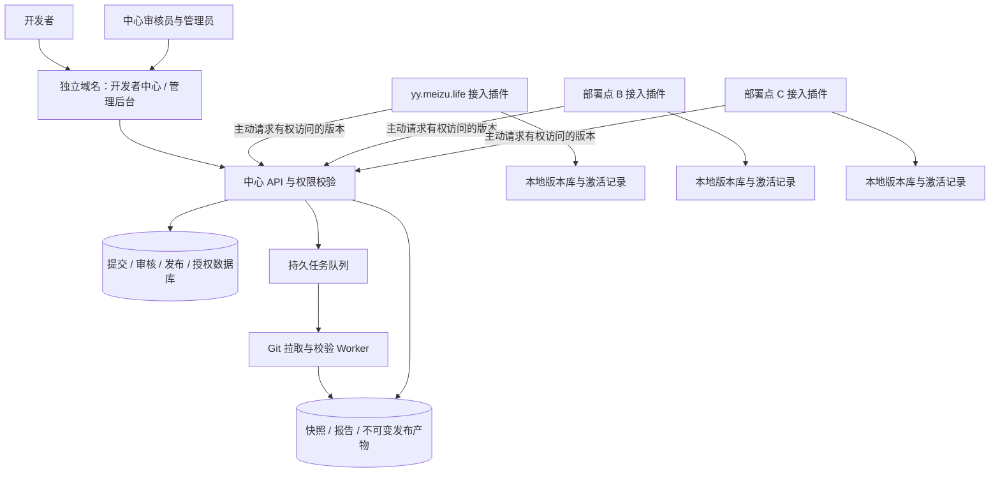

# 领域包管理中心与多部署点接入设计

> 状态：设计基线；第一阶段 W0/W1（开发者公开 Git 提交、平台审核、签名发布、授权下载）已完成，整体 Goal 仍未完成；保护 API、持久任务、四页签及实际本地 runtime 接线已交付并通过相关回归/浏览器验证，两个真实 DSH 的完整版本/断网验收与整体验收仍未完成。
> 日期：2026-09-24 更新。
> 用户已明确：独立域名管理；未来多处部署；DSH 侧以插件实现；不修改 DSH 核心。
> 本稿默认但尚待用户选择：邀请制合作方；首版通过 Git 提交领域包。
> 依据：本仓 HANDOFF、现有源代码及隔离开发核查。交接中的线上状态属于历史记录；本 Goal 的构建/测试新证据单独记载，不用历史结论代替验收。
> 业务目标重组与当前实现状态见 [PACK-CENTER-BUSINESS-OBJECTIVE.md](PACK-CENTER-BUSINESS-OBJECTIVE.md)：开发者自助交付 → 平台审核发布 → 租户自主选版运行。
> 执行拆分：[PACK-CENTER-DEVELOPMENT-PLAN.md](PACK-CENTER-DEVELOPMENT-PLAN.md)。客户端远程目录、拉取与手动检查更新为首版必做能力。
> 当前阶段 Goal：[PACK-CENTER-PHASE1-GOAL.md](PACK-CENTER-PHASE1-GOAL.md)。

## 1. 产品边界与首版决策

一个独立的领域包管理中心服务所有部署点。开发者向中心提交；中心管理员审核并发布；各部署点管理员自行选择版本、安装和启用。中心发布不触发部署点自动更新。

| 项目 | 首版设计 |
|---|---|
| 中心入口 | `https://packs.<主域名>`，具体域名部署时配置，不写死 |
| 已知部署点 | `https://yy.meizu.life`，仅为一个接入实例 |
| 上传对象 | 现有 V2 领域包：专家、场景、技能、模板等；脚本声明作为内容审查，提交与安装流程不执行脚本 |
| 提交方式 | Git HTTPS 地址 + ref；首版包位于仓库根目录；解析后固定 commit |
| 开放方式 | 邀请制；不开放匿名上传；组织与部署点授权从首版纳入 |
| 审核策略 | 所有新发布都人工审核；Git host 白名单只控制来源准入，不等于审核通过 |
| 发布范围 | 本组织、指定组织或部署点、全部已认证部署点；不默认匿名公开 |
| 分发生效 | 部署点主动下载，安装完成默认未启用；管理员显式启用 |
| 更新与回退 | 选择固定 release；保留本地旧版本，支持离线回退 |
| 独立运行 | 中心故障不影响已有本地包运行；新安装在线取得授权；允许回退到已缓存版本 |
| 代码边界 | 中心独立进程；部署侧修改本专家库插件；DSH 核心零改动 |

后续范围：ZIP 输入、私有 Git 凭据、匿名公共目录、可执行 DSH 插件、远程批量部署、自动更新。它们不能在首版界面中显示为已支持。公开 Git 提交无法保护源仓库本身的保密性；中心私有授权只保护中心的记录与分发。

## 2. 总体架构



中心不依赖任何一个 DSH 实例启动，不读取部署点会话、用户文档或统一记忆库。部署点通过出站 HTTPS 访问中心；中心无须直接访问部署点内网。首版中心“部署点”页用于登记、授权和凭据管理，不宣称实时在线监控；安装状态以本地为准。

推荐服务形态：TypeScript API、React 管理界面、独立 Worker、PostgreSQL、私有 S3 兼容制品存储。Web 与 API 同源；任务首版由数据库保存并以租约领取，不另引入消息中间件。测试环境可使用本地制品存储适配器。具体运行时与依赖版本在实施时锁定，不沿用生产 DSH 的混合依赖树。

2026-09-19 实施注记：隔离树中心网页首版采用原生 DOM / ES modules + 本地 CSS，未引入 React 运行时；同源服务与 CSP/权限边界保持不变。已接通“我的提交 / 审核队列 / 发布管理 / 部署点 / 组织与成员 / 分发审核”，具体路由见 `/root/zhijian/dsh-pack-center-dev.ZGtty5/apps/pack-center/README-web.md`。下述界面表是目标能力，不代表客户端四页签或全部验收已交付。

工程暂采用同仓分包，便于协议与接入端同步验收：

```text
dsh-expert-library/
├── apps/pack-center/          # 新增，独立安装、构建、部署的中心服务
├── packages/pack-contract/    # 新增，接口、发布清单与报告 schema
├── src/host/                 # 现有插件：中心接入、下载、安装、授权
├── src/client/               # 现有插件：本地目录与版本管理 UI
├── src/v2/                   # 现有本地校验与运行加载；保持加载链零网络
└── scripts/                  # CLI 与部署前检查
```

中心构建不进入现有插件的默认 build/test，不进入插件发布文件清单。增加一个可独立导入的纯本地校验入口，复用当前 loader/validator；不导入完整 DSH 插件入口，不复制出第二套校验规则。中心、CLI、插件使用有版本标识的同源校验器。

## 3. 界面与操作路径

中心统一导航为“包目录 / 开发者中心 / 审核管理 / 部署点 / 组织与成员”，按权限展示。隐藏菜单之外，服务端逐请求校验权限。

| 页面 | 主要内容 | 主要操作 |
|---|---|---|
| 包目录、包详情 | 名称、发布者、用途、版本、兼容性、依赖、可见范围 | 浏览版本、查看变更；不在此直接控制部署点安装 |
| 开发者：我的包 | 所属组织的包、最新发布、进行中的提交 | 新建包、提交新版本 |
| 开发者：提交版本 | Git URL、ref、说明、变更记录、许可证、预期发布范围 | 保存草稿、拉取校验、查看结果、提交审核 |
| 开发者：提交详情 | 固定快照、诊断、版本差异、审核时间线 | 撤回待审提交、根据退回意见创建修订 |
| 管理员：待审列表 | 包、版本、组织、提交者、等待时间、诊断摘要 | 筛选、进入详情 |
| 管理员：审核详情 | 内容预览、与上一版差异、脚本/权限声明、许可证、发布范围 | 填意见、退回、拒绝、通过并发布 |
| 管理员：发布管理 | 发布结果、版本历史、分发范围、审计记录 | 下架、经审核扩大分发范围、重试失败的发布 |
| 管理员：组织与成员 | 邀请、组织归属、角色、账号状态 | 邀请、调整权限、禁用 |
| 管理员：部署点 | 所属组织、标识、下载授权、凭据状态 | 登记、生成绑定码、轮换/撤销凭据 |
| DSH 插件：中心连接 | 中心地址、绑定的部署点、连接结果 | 绑定、验证连接、解除绑定 |
| DSH 插件：可安装包 | 有权访问的版本、兼容检查、依赖、已装情况 | 手动刷新、下载并安装 |
| DSH 插件：已安装 | 当前启用版、已下载版、本地改动、操作记录 | 启用、停用、更新、回退、卸载 |
| DSH 插件：更新 | 当前启用版、最新可见版、兼容候选、变更及阻断原因 | 检查更新、下载更新、明确选择更新并启用 |

插件在 **设置 → 领域包** 中提供“领域包目录 / 已安装 / 更新 / 来源设置”四个页签，上表“中心连接”归入来源设置；既有只读本地健康预览命名为“领域包校验”。首版手动检查远端版本；检查仅查询元数据，未授权、离线或失败不能显示“已是最新”。具体更新语义和本地路由见开发计划 §4。

开发者提交采用三个步骤：填写来源与说明 → 查看校验和内容快照 → 确认提交审核。技术错误可展开定位文件；常规状态采用“校验未通过”“待审核”“待发布”等明确用语。

审核详情布局：顶部显示包与版本；主区提供“内容 / 变更 / 校验 / 审核记录”标签；侧栏展示提交人、发布范围和审核操作。通过按钮只有校验通过、当前快照未变化且操作者有权时可用。

本地安装页必须分别显示“已安装”和“已启用”。例如：B 点已启用 1.0，已安装但尚未启用 1.1；A 点可以同时继续运行 1.0。下载失败、无权访问、中心不可达分别显示，不伪装成空目录。

## 4. 身份、组织与权限

| 身份 | 可以做 | 边界 |
|---|---|---|
| 开发者 | 管理所属组织授权给自己的包和提交 | 不能审核自己的提交，不能直接发布 |
| 中心审核员 | 查看分配范围内材料、退回、通过并发布 | 不自动拥有部署点安装权；不能自审 |
| 中心管理员 | 管理组织、成员、包归属、发布与分发策略 | 内容审核仍保留操作者和独立记录 |
| 部署点管理员 | 在本地绑定中心、安装、启用、回退、卸载 | 不自动拥有中心审核权 |
| 部署点机器身份 | 查询授权目录、获取清单和下载许可 | 无提交、审核、成员管理或远程安装权限 |

中心的人类登录采用独立 OIDC 登录接入，邀请及组织成员关系由中心管理；账号键为发行者与 subject，不把浏览器填写的 email 当身份。若没有现成身份服务，中心部署须一并配置独立身份服务，这是部署依赖。中心不与 `yy.meizu.life` 共享 DSH cookie。

中心会话用同源、安全 cookie 与写请求保护。开发者 CLI 后续使用中心签发、可撤销的个人凭据，不借用 DSH 浏览器 cookie，不要求关掉认证门。

首版本地管理员授权沿用插件现有管理栅栏与平台登录门；它尚无可验证的人名身份。本地审计记录部署点及管理凭据标识，不伪造实名操作者。若要求本地操作实名追溯，再在插件内接入独立登录；不读取 DSH 私有内部身份接口。

绑定流程：中心管理员登记部署点 → 生成一次性、短时绑定码 → 本地管理员在插件输入中心地址与绑定码 → 本地宿主向中心兑换仅属于该点的机器凭据。凭据保存在宿主凭据机制或专用权限受限文件，中心只存验证材料，前端不保存机器密钥。签名公钥指纹在绑定时通过管理员可信渠道核对。

人员权限按组织范围判定；审核人从指定审核范围读取私有材料。目录、详情、版本清单和下载许可执行相同授权。扩大已发布包的可见范围须独立审核，不能开发者自行把内部包改为公开。

## 5. 对象与状态流转

### 5.1 Submission：一份不可变送审快照

```text
草稿 → 拉取/校验中 → 校验失败
                   └→ 校验通过待提交 → 待审核 → 已通过
                                             ├→ 退回修改
                                             ├→ 已拒绝
                                             └→ 已撤回
```

固定字段包括提交者、组织、包、版本、来源 URL、请求 ref、解析 commit、内容摘要、归档摘要、校验器版本、报告、说明、发布范围。送审后不能原地更换内容；修改产生新快照和新提交。校验失败后重试拉取也生成新尝试记录。

校验通过不代表可发布。批准动作校验 submission 版本和摘要；两个审核员并发处理只允许一个状态迁移。发布者本人若提交，须由另一个有审核权的人处理；试点需具备这个人员条件。

### 5.2 Release：可分发的版本

```text
审核通过 → 生成发布记录与签名 → 已发布 → 已下架
                         └→ 发布失败，可重试
```

“通过并发布”可是一颗 UI 按钮，后台仍分开记录审核决定和发布任务。发布失败只能重试同一快照，不能重新拉取分支、重新适配内容后沿用旧批准。

包 ID 全局唯一并归属于组织，建议新包使用符合现有 SafeId 的 `orgslug.packslug`，不直接把带斜杠的组织名写进运行时 ID。`packId + version` 发布后不可覆盖；同一版本修订需新版本号。实体 ID 也应使用组织/包前缀；中心检查保留命名，本地检查真实合并冲突。

下架表示停止新分发，不代表删除所有部署点中的副本。撤销组织授权同样不追溯销毁已经交付的离线内容。已缓存包继续运行，已知下架风险在本地操作页提示；已安装历史保留。

### 5.3 Installation：每个部署点自己的状态

```text
获取下载许可 → 下载/验证 → 已安装未启用 → 已启用
                   └→ 失败，保留旧版     └→ 已停用
```

更新先安装新版本，显式切换启用版本；回退切换到保留的本地旧版本。单次安装失败不影响旧包，中心发布状态不表示本地安装成功。

## 6. 发布产物与校验口径

Worker 先固定 commit，再规范化包树、校验、生成内容预览与差异、打包并保存。规范化规则固定版本；例如移除 Git 元数据、处理 generated 产物的规则必须发生在送审摘要形成前，并把处理结果展示给审核人。

发布只引用已经审核的归档。清单与校验报告放在包树之外，避免自引用摘要和安装后补写文件改变已审内容。清单至少包括：

```text
protocolVersion, normalizationVersion, digestAlgorithmVersion, signatureAlgorithm
releaseId, packId, ownerOrgId, version
sourceCommit, artifactSha256, contentTreeSha256, reportSha256
validatorVersion, packSchemaVersion, requiresPlugin
dependencyLock, sizeBytes, fileCount, approvedSubmissionId, signingKeyId
```

归档摘要验证下载字节；树摘要验证安全解包后的内容；首版使用完整包树的确定性摘要，不在安装时补写或删改树内文件。规范化及摘要算法有独立版本，并提供中心、CLI、插件共用的校验样例。清单使用规范 JSON 字节与分离的 Ed25519 签名；签名覆盖身份、版本、兼容要求、依赖与所有摘要。公钥属于插件的信任配置；密钥轮换采用新旧公钥重叠和显式信任更新，不从一个任意下载地址盲目信任新公钥。

协议 v1 约定：文件相对路径以 `/` 分隔并按 UTF-8 字节序排列，内容按原始字节计算；全树摘要由有路径边界的单文件摘要确定，不依赖本机排序区域设置、mtime 或权限位。清单对象键递归排序、数组保序、UTF-8 编码、无多余空白，签名字节不含外置 signature；未知算法/规范化版本必须拒绝而非猜测。实施时将确切编码函数与测试向量纳入 pack-contract。

校验 Worker 不持有发布签名私钥，不运行仓库安装命令、构建命令或 hooks。远程 Git 仅准入 HTTPS、公网目标；域名解析、重定向与实际出网目的地须受约束。任务限制时间、磁盘、文件数及日志体积；外部来源提交不得继承生产进程的凭据环境。

安装器拒绝归档中的路径逃逸、链接和超限内容。先验证来源清单与归档，再解包、复验树摘要和本地 schema。脚本声明仅作为元数据和审核内容，安装流程不执行。

中心校验依赖的“是否已发布、是否允许分发”；本地启用前校验“目标版本是否已安装并启用、兼容性是否满足”。单纯下载到未启用库存不要求依赖已经启用。不能把中心数据库中的包列表当成本机已安装列表。现有 `dependsOn` 只有 ID，首版发布清单补充固定依赖 release；内置包依赖另列所需插件/内置包版本条件，不伪造中心 release。不实现自动浮动依赖求解或隐式安装。依赖形成环、缺失或无下载权时明确阻断相应发布或启用操作。

对象存储默认私有；鉴权后签发短时下载地址或由 API 代理。已签发地址在失效前可能继续可用，下载凭据撤销不宣称即时回收已有链接。制品键不可覆盖，草稿清理与已发布产物留存分开。

## 7. 插件本地安装与离线运行

中心包使用独立本地版本库，避免把缓存目录放进旧的自动扫描目录：

```text
<DSH_HOME>/pack-center/
├── releases/<release-address>/   # 中心ID+releaseID的规范摘要地址
│   ├── release.json             # 签名发布清单，位于包树外
│   └── content/                 # 审核产物原始内容，不补写/删改
├── legacy/<contentTreeSha256>/   # 本地接管备份，非中心审核
│   ├── legacy.json              # 本地来源收据
│   ├── artifact.tar             # 本地备份原归档
│   └── content/
├── state.json                    # 安装/启用/generation/operation/永久版本账本
├── state.prev.json               # 上一已验证状态，仅用于异常恢复
├── .state.lock                   # Linux flock父进程fd持锁，不删除锁文件
├── .incoming/                    # 每次独立的中心产物暂存目录
└── .legacy-incoming/             # 每次独立的本地旧包暂存目录
```

插件宿主读取 state 的启用映射，向本地解析器提供明确的包目录；解析器仍只访问本地。现有 builtin/workspace/vendor 发现规则兼容保留，但中心包只能通过此映射参与运行。新包不因“目录里出现了文件”而自动生效，所有中心包都停用是合法状态。

安装事务按单部署点跨进程写锁串行：验证完成并落盘不可变版本 → 校验当前 generation → 保存上一有效状态 → 唯一临时文件写入新 state 并同步 → 同文件系统原子替换 state 并同步父目录 → 清除运行缓存。安装记录与启用指针在同一状态提交内变更，不把目录和 registry 的两个写入当作一个原子事务。

预提交崩溃最多留下未引用产物，旧 state 有效；提交后崩溃按 operationId 与 generation 恢复完成状态。失败时保留旧版本，不先删除旧目录。垃圾回收不能删除当前启用版、上一可回退版、固定保留版及运行中任务引用的版本。

state 损坏不能解释为空库：保留损坏文件并停止写入，仅在上一快照、引用的签名清单及其内容完整性复验通过时进入只读恢复模式，提示管理员确认恢复；没有有效快照时显示中心包不可用，保留 builtin/workspace 正常加载，不能声称所有历史包仍正常运行。

启用前执行与当前本地包的合并预检，拒绝未经明确授权的包 ID/实体覆盖和缺失依赖。缓存键包括本地 generation；切换后新任务使用新版本，已有任务继续其已编译计划，并保持旧内容可读直到任务结束。这一行为需要专项测试，不把“有缓存失效函数”当成已证明。

新下载使用中心在线授权；从已验证本地库存回退不访问中心或 Git。网络失败不降级到任意 Git 源绕开中心批准。本地内容改动或未知完整性必须明确报错，不能静默覆盖。

## 8. API 与数据边界

以下为拟定协议，不是已上线接口。中心统一 `/api/v1`；浏览器和机器凭据分别授权。

| 接口 | 使用者 | 含义 |
|---|---|---|
| `POST /submissions` | 开发者 | 创建草稿，服务端确定 owner/author |
| `POST /submissions/:id/validate` | 提交者 | 排入抓取校验任务，返回 jobId |
| `GET /submissions/:id` | 有权限人员 | 查看快照、报告、状态和历史 |
| `POST /submissions/:id/submit` | 提交者 | 固定已验证快照并送审 |
| `POST /submissions/:id/withdraw` | 提交者 | 撤回尚未批准的提交 |
| `POST /submissions/:id/reviews` | 审核员 | 以预期状态和摘要通过、退回或拒绝 |
| `GET /releases`、`GET /releases/:id` | 人员/部署点 | 只返回有权访问的已发布版本 |
| `POST /releases/:id/download-grants` | 有权限身份 | 返回固定清单及短时下载许可 |
| `POST /releases/:id/yank` | 中心管理员 | 停止新分发并记录原因 |
| `POST /deployments`、`POST /deployments/:id/binding-codes` | 中心管理员 | 登记部署点与生成绑定码 |
| `POST /deployment-bindings/exchange` | 本地宿主 | 一次性兑换部署点凭据 |
| `POST /deployments/:id/credentials/revoke` | 中心管理员 | 撤销指定点凭据 |

本地扩展 `/plugins/dsh-expert-library/manage/center/*`：连接、目录、安装操作、启用、停用、回退与卸载。调用先经过本地管理员栅栏；机器凭据只供插件宿主出站访问中心，不接受它直接调用本地写接口。

写 API 使用幂等键；状态迁移带 expectedVersion，冲突返回 409。所有权从认证与数据库推导，不信任请求体自报 orgId。异步任务持久记录尝试、租约、超时和恢复；UI 展示 job 状态而不是长请求成功假象。

中心数据对象：User、Organization、Membership、Pack、Submission、ValidationRun、Review、Release、DistributionGrant、Deployment、DeploymentCredential、Job、AuditEvent。Submission/Release 关联不可变摘要，权限范围不放在浏览器控制的字段中。发布事务创建唯一 Release 与发布任务；Worker 幂等确认产物可用后才标记 published。

审计保留何人、何时、对哪个固定对象做了什么以及结果；日志脱敏，不保存 token、私有下载链接和仓库凭据。机器请求记部署点，本地共享凭据操作不冒充具体个人。

## 9. 现有代码复用与必须补齐的缺口

已有可复用：`src/v2/pack-loader.ts`、`validate.ts` 的本地校验；`src/host/auth.ts` 的本地管理栅栏；`src/client/index.tsx` 的插件 UI 扩展入口；`src/host/pack-source.ts` 的部分拉取与检查逻辑；`invalidateRuntimePack()` 的缓存清理入口。

本轮代码检查发现以下差距。它们是设计前提，不表示已修复或已做线上复现：

| 现状证据 | 对设计的影响 |
|---|---|
| `pack-source-routes.ts` 的 needsReview 响应后删除 staging，批准重新拉 Git | 新增持久送审快照，批准绑定摘要 |
| `auth.ts` 只有 loopback/token；`approve:true` 没有人员角色 | 中心独立身份与审核权限；本地令牌不用于开发者提交 |
| `installStagedPack()` 删除 target 后 rename；暂存名仅由 PID 和包 ID 派生 | 新建不可变版本库和原子状态提交，支持并发与崩溃恢复 |
| `pack-registry.ts` 使用固定 `.tmp`，读损坏文件当空库 | 中心包状态读取损坏必须阻止写入并报告；不可将旧 registry 作为中心数据库 |
| 回退重新拉 Git，未将旧树保存在本地 | 新增本地保留版本，验证后离线回退 |
| knownPackIds 包含当前已装包，而校验对同 ID 一概报冲突 | 区分同一归属包升级与另一来源抢占；不能跳过全部冲突校验 |
| `hashPackageTree()` 的 exclude 是精确路径匹配；`['generated/']` 不排除整棵子树；安装删除 generated 后未在该函数写回锚点 | 统一摘要与完整性规则；中心清单外置；不可直接宣称现有安装必为 clean |
| `enabledPacks` 空/缺失表示全部参与，发现逻辑扫描 vendor 子目录 | 中心包使用显式启用映射，默认未启用，缓存依赖 generation |
| CLI HTTP 调用仍经过 DSH cookie 门；package.json 也未声明 CLI bin | 开发者首版走中心网页；CLI 接中心需专门认证和打包接线 |

旧 vendor 安装不自动认定为“中心已审核”。迁移先登记为本地历史包，保留来源和现状；换成中心管理版需明确操作并处理同 ID 冲突。本地 Git 直装是管理员高级能力，标记为本地来源；受中心管理的包禁止借该入口绕过发布状态。

接管时先备份并校验旧包，再在同一次 state 提交中登记中心启用版和被接管的具体 vendor 路径；旧目录发现按这条路径排除，原目录及本地快照保留用于恢复。不能按 packId 一概隐藏 builtin/workspace 等其他来源。中心包停用不自动复活旧副本；只有明确“恢复本地管理”才解除路径排除。旧副本恢复依据本地迁移摘要，不伪造中心签名。

## 10. 实施阶段与出口

| 阶段 | 交付 | 出口条件 |
|---|---|---|
| P0 协议与本地可靠性 | 固定提交/发布 schema、同源校验入口、不可变本地版本库、启用映射、旧包迁移规则 | 安装中断保留旧版、并发一致、离线回退、全部中心包停用均通过 |
| P1 中心提交能力 | 独立服务、登录邀请、组织、Git 校验任务、开发者页面 | 两个组织相互隔离，提交内容固定、重启后任务可恢复 |
| P2 审核与发布 | 审核页面、持久 Review、签名产物、私有分发与发布目录 | 自审拒绝、并发审核一次生效、发布失败幂等重试、摘要一致 |
| P3 部署点接入 | 绑定凭据、本地目录与安装 UI、兼容/依赖检查 | 两个独立实例可安装不同版本，安装不自动启用，中心断网仍运行及回退 |
| P4 试点与交付 | 可运行样例、开发者指南、管理员指南、部署备份恢复、接入说明 | 完整演示提交→退回→修订→发布→两点安装→更新→回退→停止分发 |

实施从协议和本地安装可靠性开始，随后交付一个端到端最小样例，再完善各页。重启前护栏仍是现有生产实例部署前置项，单独放在插件脚本与宿主调用接线上；中心领域包操作本身不应依赖重启 DSH。

本稿不给未经估算的工期。域名、身份服务和制品存储端点在部署前确定；不阻止先完成协议、页面原型、测试夹具及本地验证。

## 11. 必须演示的验收场景

1. 开发者从网页提交样例 Git，看到明确的校验报告；无管理令牌也可完成本人范围内的提交。
2. 审核员退回并说明原因；开发者修订产生新快照，旧意见和旧内容仍可追溯。
3. 开发者不能自批；A 组织不能读取 B 的私有提交、清单或下载内容；站点凭据不能调用审核接口。
4. 送审后上游分支或 tag 移动，审核预览与最终下载仍对应原 commit 和原字节。
5. 发布失败与并发批准只形成一个确定版本；扩大可见范围须经过独立审核。
6. 被篡改的清单、归档或解包内容被拒绝，旧版本保持可用；无脚本被安装流程执行。
7. 两个测试部署点分别运行不同版本；中心发布新版本不会自行改变任何一点。
8. 安装成功但未启用的包不参与编译；所有中心包停用后仍不参与；新任务和运行中任务版本语义明确。
9. 下载失败、进程在状态提交前后退出、并发更新及本地内容改动均不静默丢失旧版。
10. 中心和 Git 均断网，已启用包继续使用，本地历史版本仍可验证并回退。
11. 中心下架或撤销分发授权后，新下载被拒；既有副本不被远程删除；短时链接失效窗口符合说明。
12. 核心安装目录无代码修改；本地加载链 no-network 测试保持通过；插件构建与现有领域包行为无回归。

验收先在两个隔离实例执行。生产试点沿用独立部署检查流程，不用生产服务验证故障注入。

## 12. 尚待业务选择与技术参考

以下为本稿采用的默认方案，不记作用户已批准：邀请制而非开放注册；Git 领域包先行，ZIP 与可执行 DSH 插件后续。用户若选择不同范围，应调整对应身份/输入/安装章节后再实施。

技术参考（仅支撑选型与边界，不代表当前项目已有实现）：

- [OpenID Connect Core](https://openid.net/specs/openid-connect-core-1_0.html)：中心采用独立的标准身份接入；组织和角色由本服务授权。
- [PostgreSQL 并发锁文档](https://www.postgresql.org/docs/current/explicit-locking.html)：用于审核状态与任务领取的事务并发控制；制品存储与数据库不假定跨系统原子提交。
- [S3 预签名地址说明](https://docs.aws.amazon.com/AmazonS3/latest/userguide/using-presigned-url.html)：短时下载地址仍是可使用的访问凭据；授权检查、过期和撤销语义需明确。

相关本仓文档：[HANDOFF.md](HANDOFF.md)、[PACK-SOURCE-REGISTRY-DESIGN.md](PACK-SOURCE-REGISTRY-DESIGN.md)。本稿是独立中心的后续设计，不把旧设计的完成声明扩展为中心能力已交付。
