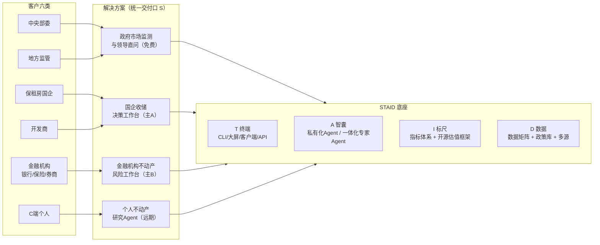

# 智见（政研通对外名）· 汇报大纲 —— STAID 分层版 v1

> 日期：2026-08-25 ｜ 用途：汇报大纲 ｜ 底稿：智见 BP v37 叙事延续
> 一句话定位：**不动产重大决策的事实与审计基础设施** —— 卖的不是数据，是经得起审计的决策过程。

---

## 〇、一页总览

- **客户**：中央部委、地方监管、金融机构（银行/保险/券商）、保租房国企、开发商、C 端个人
- **方案**：政府端免费入口（建标准、共识与数据入口）＋ B 端机构年费（机构基础包 / 业务解决方案包 / 扩展包）
- **产品**：主 A 国企收储决策工作台 ｜ 主 B 金融机构不动产风险工作台 ｜ 辅 政府市场监测与领导直问 ｜ 远期 C 端个人不动产研究 Agent
- **架构**：STAID 五层（D 数据 → I 标尺 → A 智囊 → T 终端 → S 方案统一交付口），五条横向链贯穿（Identity / Version / Evidence / Approval / Replay）
- **竞品一句话**：竞品卖数据/报告/榜单/单点评估，我们卖可审计的决策过程

---

## 一、客户与解决方案（Q1）

### 1.1 六类客户分述

每类按四个维度展开：**需求痛点 ｜ 行业最佳实践 ｜ 我们的解题思路 ｜ 预计数据源**。

**① 中央部委（住建部、央行、金融监管总局、发改委等）**
- 需求痛点：全国层面市场监测依赖地方报送，口径不一、更新滞后；政策效果缺乏可核验底稿；跨部门数据分散，"看不见决策过程"。
- 行业最佳实践：统计局 70 城房价指数（只给同环比）；央行城镇储户问卷；住建网签系统；REITs 信息披露制度。
- 我们的解题思路：政府市场监测与领导直问入口（免费，换标准与共识）；统一口径指数；政策效果复现（给定历史时点重放数据、假设与计算）；只描述已发生、不做趋势承诺。
- 预计数据源：住建网签备案（自爬）、统计年鉴与 70 城（自爬）、自然资源部土地市场网（自爬）、政策文本库（自爬+合作）。

**② 地方监管（省住建厅 / 市住建局、房管局、地方金融监管）**
- 需求痛点：区县口径对齐难；小区级价格缺失；舆情与价格监测手段弱；40 城 vs 50 城口径差异要向领导解释清楚。
- 行业最佳实践：成都样板（区县对齐、极端值裁尾、小区价格、迁移指数）；统计局 70 城只给同环比的做法。
- 我们的解题思路：地方版监测（地图→城市→区县→小区价格、迁移指数）；市场监测大屏（白标）；领导直问（白名单 300 人）；过舆情审核后再对外。
- 预计数据源：地方网签/备案（自爬）、自有挂牌与成交（自有）、迁移指数（合作）、土地（自爬）、政策库（自爬+合作）。

**③ 金融机构（银行、保险、券商）**
- 需求痛点：抵押物估值依赖单点评估报告，贷后无持续监测；压力测试缺数据与统一口径；不动产风险敞口难量化；评估报告不可复现、签章责任重。
- 行业最佳实践：巴塞尔 IRB 内评体系；银行押品管理（双人复核、定期重估）；REITs 估值 CapRate 法；DSCR 压力测试（监管压力情景）。
- 我们的解题思路：主产品 B 金融机构不动产风险工作台：**T0 估值 + T+N 监测/预警**——抵押物估值参考、价值偏离预警、持续可查的价值台账；估值只做过程不做结论（做底稿、不做签章）。
- 预计数据源：银行押品与信贷台账（合作输入）、土地供给数据（自爬）、消费信贷关键表现（合作输入）、公开成交/挂牌（自有+自爬）、租金（自有+采购）。

**④ 保租房国企**
- 需求痛点：收储决策不可复现（一项目一评估）；缺四本账（事实/假设/方法/责任）；DSCR 与租金定价测算口径不一；"项目可以不赚钱，过程不能说不清"。
- 行业最佳实践：保障房 REITs 信息披露与审计要求；评估机构双签；政府收储政策工具箱（收购折扣、财政补贴、贴息贷款）。
- 我们的解题思路：主产品 A 国企收储决策工作台：收储测算包（收购折扣 × CAPEX × 保租租金 × 出租率 → NOI → DSCR 基准/压力双情景）、四本账 + 审批链 + 复现链、证据逐级下钻。
- 预计数据源：自有挂牌/成交/租金、项目级租约与现金流（客户提供）、政策库（自爬+合作）、土地（自爬）。

**⑤ 开发商**
- 需求痛点：城市进入与拿地决策依赖经验和外部报告；项目定价与去化预测缺可复核依据；投后复盘无底稿。
- 行业最佳实践：头部房企城市地图与客研体系；中指/克而瑞榜单与数据库。
- 我们的解题思路：城市监测订阅（标准组件交付：CLI 查询、客户端、API）；开盘定价支持（条件化解释、不承诺结果）；土地供给与去化周期分析。
- 预计数据源：土地市场（自爬）、网签（自爬）、自有成交与带看（自有）。

**⑥ C 端个人**
- 需求痛点：信息不对称、中介话术、买卖/置换/租金判断不可验证。
- 行业最佳实践：贝壳"真房源"、诸葛找房/兔博士类轻量工具。
- 我们的解题思路：个人不动产研究 Agent（远期产品）；现阶段不做收入指标，做数据入口与口碑。
- 预计数据源：公开挂牌/成交（自有+自爬）、教育划片（自爬+合作）。

### 1.2 商业模式落点

- 政府端（部委/监管）：**免费入口**，三样非现金回报——标准、共识、数据入口。
- B 端年费三包：**机构基础包**（数据+模型服务）｜**业务解决方案包**（工作台定制+私有化部署）｜**扩展包**（Token 额度、大屏、API、嵌入式组件）。
- 定价纪律：先立纪律、再谈数字；银行千万级合同为目标假设（需验证），不写进对外承诺。

---

## 二、竞品分析（Q2）

### 2.1 竞品地图

| 竞品类型 | 代表 | 怎么做的 | 优势 | 劣势 |
|---|---|---|---|---|
| 数据+榜单型 | 中指控股（CREIS） | 数据库订阅+排行榜+顾问服务 | 覆盖广、品牌强、榜单被广泛引用 | 口径黑箱；报告不附带可复现底稿；决策过程不可审计 |
| 数据+咨询型 | 克而瑞（CRIC） | 数据库+行业咨询+榜单 | 研究深度、行业人脉 | 人力密集型、交付标准化、成本高；过程不可复现 |
| 金融终端型 | Wind / 同花顺 iFinD | 金融数据终端 | 金融客户覆盖广、宏观证券数据强 | 不动产微观数据（房源/成交/租金）弱；无决策工作台类产品 |
| 平台自研型 | 贝壳研究院（生态内） | 依托自有真房源成交数据做研究 | 数据真实度高、独有 | 对外口径保守；以服务生态决策为主，非完整商用产品线 |
| 房源平台型 | 58 安居客 / 乐居 | 房源信息+广告流量 | 流量大、C 端触达 | 数据噪声大、口径混乱、非决策级 |
| 评估机构 | 世联、国策等 | 单点评估报告+法定签章 | 法定地位、合规资格 | 单点、慢、贵、不持续；不提供过程审计 |
| C 端工具 | 兔博士、诸葛找房 | 免费轻量查询工具 | 轻量、获客快 | 数据源浅、无 B 端决策链 |

### 2.2 差异化结论

- 竞品卖**数据/报告/榜单/单点评估**，我们卖**可审计的决策过程**：四本账（事实/假设/方法/责任）+ 五条横向链（身份/版本/证据/审批/复现）+ 同条件重放。
- 竞品最难跟上的工程量：**假设版本、审批快照、同条件复现**——这三项是客户愿意付年费的部分。
- 边界声明：不与评估公司抢签章、不与数据商比条数；评估机构方法论可作协作对象。
- 数据供应商（久谦等）是**上游采购渠道**而非竞品，划清"买数据 vs 卖决策"的定位。

---

## 三、T·A·I 三层规划（Q3）

### 3.1 T 终端层：标准组件 + 定制化交付

**标准组件（开箱即用）**
- **CLI**：命令行查询、批处理、报表脚本、自动化运维（供数据团队/ISV 集成）
- **大屏**：政府市场监测大屏、银行风控监测大屏（可白标）
- **客户端**：网页工作台（估值工作台、监测预警台、审批台）、桌面端
- **API 与嵌入式组件**：指标接口、报告接口、嵌入式仪表盘、消息推送

**定制化交付（按客户决策流程定制）**
- 私有化部署：整套终端下沉客户环境，数据不出域
- 白标：客户品牌与配色（贝壳蓝/银行蓝等）
- 系统集成：与 OA、信贷审批流、评估系统、数据仓库对接
- 专属终端：按客户决策流程定制"录入假设 → 发起审批 → 查验 → 复现"闭环

**原则**：终端不只是"看数据"的地方，而是**决策动作发生的地方**。

### 3.2 A 智囊层：两类 Agent

**Agent A · 私有化与预置专家（数据敏感场景）**
- **私有化部署**：模型 + 知识框架 + 工具链整体下沉客户环境（银行、国企等数据敏感场景，满足合规要求）
- **预置专家**：专家知识框架预装（33+ 位专家、五域分类、BK 档案），不依赖外部模型调用、离线可用

**Agent B · 一体化专业 Agent（效率-成本-质量三重最优）**
- 四件套一体：**专家 skill**（解读框架/路由/输出规范/技能包）＋ **专用 agent harness**（任务编排、工具调用、证据链回写、多步推演）＋ **垂类模型**（不动产语料微调）＋ **专用终端**（对话+底稿+审批一体）
- 对比"通用大模型 + 通用终端"：**效率更高**（一次成稿、少返工）、**成本更低**（Token 用量少、缓存复用）、**结果更好**（口径统一、带证据、可审计可复现）

**能力边界（沿用 v37 纪律）**
- 只做四件事：解释、检索、条件推演、组织证据
- 明确不做三件事：不做趋势承诺、不替客户决策、不隐藏不确定性
- 专家引擎原则：卖稳定的观点结构、不卖某个人的名字；输出必带引用与假设条件

### 3.3 I 标尺层：标准化指标体系 + 开源估值框架

**标准化指标体系**
- 三大一级指数：价格指数（基期 2020-01）、活跃指数（基期 2024-01）、信心指数（暂无基期、**暂缓对外**）
- 子指数共 7 项；呈现**只给同环比**（参照统计局 70 城做法）
- 覆盖口径：40 城 vs 50 城差异需向领导专项说明
- 每指数强制附带释义：100 以上意味着什么、以下意味着什么

**开源估值框架（两套公开锚 + 一套现金流模型）**
- **中房协"好房子"标准**：安全耐久、健康舒适、绿色低碳、智慧便捷等品质维度 → 品质溢价与价值锚
- **不动产 CAPM**：Rf + β×ERP + 流动性溢价 + 政策风险溢价 → 折现率/资本化率锚定
- **NOI/DSCR 现金流模型**：与上述两锚打通 → 收储定价、抵押物估值、REITs 分派对标

**纪律**：指数只描述已发生、不预测未来；估值框架开源化沉淀行业共识。

---

## 四、D 数据层规划（Q4）

### 4.1 数据矩阵（量 / 价 / 成交 × 六业态扫描）

| 业态 | 量（供给/挂牌/带看） | 价（挂牌/成交/租金） | 成交（套数/金额/去化/出租率） | 来源现状 |
|---|---|---|---|---|
| 新房 | 批售/供应量（自爬住建） | 备案价/网签价（自爬） | 网签套数、金额（自爬） | 重点 40 城可覆盖 |
| 二手 | 挂牌量/新增挂牌（自有） | 挂牌价/成交价（自有+合作） | 网签成交（自爬+合作） | **自有强项** |
| 租赁 | 在租挂牌量（自有） | 挂牌租金/成交租金（自有+采购） | 出租率/去化周期（合作/采购） | 出租率待补 |
| 酒店 | 供给间夜（采购） | ADR 平均房价（采购） | OCC 入住率/RevPAR（采购） | 采购为主（久谦/STR 类） |
| 生活服务 | 门店数/覆盖（自有） | 服务单价（自有/合作） | 单量/GTV（自有/合作） | 生态数据 |
| 教育 | 学校/学位/划片（自爬+合作） | 学区溢价（自建模型） | 入学/迁移（合作） | 敏感，公开+合作为主 |

矩阵扫描原则：每格标注**数据可得性、更新频率、覆盖城市**；先扫缺口、再定采购与合作优先级。

### 4.2 政策库

- **中央政策**：住建部、央行、金融监管总局、发改委及国务院文件——限购限贷、公积金、保租房、收储、REITs、城中村改造等
- **地方政策**：31 省 + 重点城市细则——限购/限贷/公积金/保租房/收储/人才购房等
- **结构化字段**：时间戳、发文机关、效力层级、关键词、关联条款、政策效果追踪（发布 → 市场响应 → 验证闭环）

### 4.3 数据源

| 来源 | 内容 |
|---|---|
| **自爬** | 住建网签备案、统计局年鉴与 70 城、自然资源部土地市场网、政府公告 |
| **采购** | 久谦（咨询级微观数据、专家访谈）、第三方酒店 OCC/ADR、舆情 |
| **合作** | 中房协及省市房协（标准与方法论）、银行（押品/信贷/消费贷表现）、政府（白名单与数据交换）、评估机构（方法论协作） |
| **关键输入** | 土地供给（成交面积/楼面价/流拍率/溢价率）＋ 银行消费信贷关键表现（房贷余额/新增/不良/提前还款）—— 宏观与微观联动的先行/验证输入 |

---

## 五、支撑机制（沿用 v37）

- **五条横向链**：Identity 身份链 / Version 版本链 / Evidence 证据链 / Approval 审批链 / Replay 复现链——把"能用"变成"敢用"
- **责任边界**：做过程不做结论；做底稿不做签章
- **三级商业模型**：机构基础包 / 业务解决方案包 / 扩展包；定价纪律先行
- **60 天两灯塔**：一个真实收储项目全流程 ＋ 一家银行 T0＋T+N 闭环
- **三步走**：先两个客户证明产品 → 融资转型 → 投资生态
