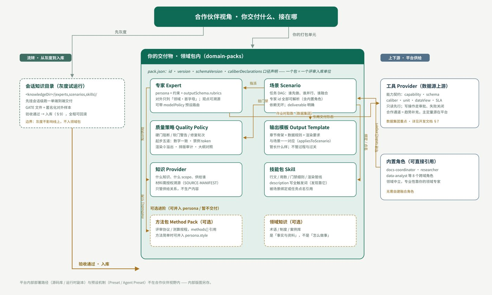

# 智见项目进度汇报（2026-08-31）

> **承接**：《20260828_智见项目进度会_会议纪要》（决议 D1–D10 · 行动项 A1–A12），98wiki `projects/政研通BP/会议纪要/`。
> **用途**：① 周度进度汇报；② 9 月 1 日数据公司股权专项会的输入材料。
> **补充素材**：0830 长租公寓合作讨论（深圳安居微棠）、0831 快速会议×2（收储估值与 Agent 交付）、《智见专家 Agent · 合作伙伴开放能力开发文档》（partner-devdoc v1.0，2026-08-30）、0831 晚间+0901 晨间银行侧会议两轮（含上海银行准入名单截图）。
> **密级**：内部资料，请勿外传。标注（转）的数字引用前须核实。

---

## 一、本周工作进展（仅列有进展事项）

本周项目组围绕**交付体系落地、市场开拓与战略合作**三条主线推进，现将取得进展的事项汇报如下；其余行动项（A1–A6、A8）本周无新增进展，按上周纪要台账持续跟踪。

| 编号 | 事项 | 本周进展 | 状态 |
|---|---|---|---|
| A9 | AI Native 选型与训练 | 完成工具精简（40→20）与后训练固化；全国产模型+国产卡交付通过验证（深圳、成都）；流程编排范式确立；《合作伙伴开放能力开发文档》（partner-devdoc v1.0）发布（§3.2） | ✅ 实质性进展 |
| A10 | 股权结构设计稿 | 完成「三命题、三方案」研究（§5.1–5.5），形成五条决议建议，具备上会条件 | ✅ 材料就绪 |
| A12 | 租赁五板块方案细化 | 与深圳安居微棠建立战略合作接触：6 万+套动态数据合作、ISV 双向合作意向、总部交流安排（邀约已发出） | ✅ 实质性进展 |
| A11 | 优势 deck 按管理层口径复核 | 完成口径比对，识别三处修订点（§7.2），待设计团队执行 v9 版本 | ⏳ 推进中 |
| A7 | 好房子标签安全维上线 | 新增深圳 APEC 好房子论坛合作线索（微棠为东道主、贝壳为平台方），已完成参会申请 | ⏳ 持续推进 |

注：CoreLogic 对标分析（A3）为上周会议点名交付事项，已列为下周第一优先（§7.3）。

**本周三项关键成果**：

1. **福州案例形成端到端闭环**——福州安住（客户）、容诚（持牌审核与用印）、贝壳（数据与 Agent 运行时）三方分工跑通，单套 2000 元、审核用印后分成（金额转），为首个可复制商业化样本；
2. **交付范式定型**——以 Agent 为交付载体、token 为计费单元，以「种子」模式（孟山都）输出能力、不做签章，责任边界与商业模式明确；
3. **银行侧需求与准入双验证**——上海银行 2026 年评估服务四家准入名单在手；江苏银行明确集团高层对接路径与行内 Agent 集成方向；交通银行已有合作先例（量级转）。

---

## 二、市场分类与产品定义（市场侧：怎么切 · 谁最重要 · 多大——承接 A1/A2）

### 2.1 市场切分六维度（产品定义的切分框架）

> **这六条是全篇的分析框架**：每一个维度都是一个「切分刀口」，其产出直接被后续章节消费——维度 1 切出三类画像（§2.3）；维度 2 是四象限横轴与测算科目（§2.2/§2.4）；维度 3+5 合成四象限纵轴并决定交付形态（§2.2/§3.1）；维度 4 划出「不进入」红线（§2.2④·D8）；维度 6 是定价与客户模式的基准（§2.4/§5.3）。没有这六刀，后面的画像、象限、测算就没有共同的坐标系。

1. **角色**：收储持有方 / 运营方 / 资金方（国开行、银行按揭）/ 监管方——**产出：§2.3 三类画像的角色划分**；
2. **预算出口**：业务部门出钱（银行不良处置、贷前评估）＞研究部（推动但弱势）＞领导（拍板怕担责）——**产出：§2.2 四象限横轴、§2.4 测算的预算科目**；
3. **责任边界**：要盖章报告（国资体系）/ 要底稿自用（市场化）/ 只要数据+工具（银行内部体系）——**产出：§2.2 纵轴、§3.1 合规出口分层（盖章/底稿/数据工具）**；
4. **确权结构**：个人产权 / 城中村使用权（确权到国企=表外应付账款逻辑）/ 保租房「九折」口径（行业通行说法——低出租率项目方有真实需求，引述）——**产出：§2.2④「不进入」红线（D8）与收储边界**；
5. **城市供给结构**：服务充分型（上海，压价+双报告）/ 稀缺型（福州，轻量化溢价）/ 属地垄断型（深圳——属地渠道垄断格局，引述；**策略上明确不做垂类扩张**）——**产出：§2.2 纵轴合成、区域复制打法（§4.2）**；
6. **付费形态**：单次（套 2000–12500）→ 年框（银行 2000 万量级）→ token 订阅——**产出：§2.4 测算口径、§5.3 客户模式与定价**。

### 2.2 重要市场四象限（哪些是我们的重要市场）

> 横轴＝预算出口强度（左：研究部/补贴等弱付费 → 右：业务部门刚需强付费）；纵轴＝模式适配度（下：需持牌盖章/保障/垄断属性，我们不直接做 → 上：数据+工具+底稿自用，我们直接服务）。两轴即六维度中的维度 2（预算出口）与维度 3+5（责任边界/城市结构）的合成。

| | **预算出口弱** | **预算出口强** |
|---|---|---|
| **模式适配高**（数据+工具+底稿自用） | **② 培育市场**——保租房运营企业（微棠：数据互换+AI 人效，付费后置）；城投平台（收储执行、项目型付费）；行业协会/ICCRA（标准与曝光） | **① 核心市场**——银行零售/风控条线（年重估+不良+贷前，年框 2000 万量级，「1+N」新政后重估制度化 §4.1）；保租房收储国企（可解释定价+批量产能：福州/上海/南京样本） |
| **模式适配低**（需持牌盖章/保障/垄断） | **④ 不进入**——保障部分（上周决议 D8 边界）；纯研究采购（预算弱势）；散户/小中介（返佣模式出清） | **③ 伙伴承接**——必须盖章的传统评估单（上海全套 12500/套：持牌经销商出报告、我们做底稿与数据）；AMC/不良处置（AMC 牌照伙伴先行，新政东风）；深圳垂类（属地垄断——只做数据合作，不做垂类扩张） |

**六类客户入位**：银行（资金方）→ ①；收储国企（持有方）→ ①；保租房运营企业（微棠类）→ ②；城投平台 → ②；评估机构（持牌）→ ③；AMC → ③。协会/ICCRA 为生态角色（标准与背书），不单列为付费客户；市场规模测算见 §2.4。

**结论**：① 是收费主战场（银行年框+收储大盘）；② 是数据与场景的杠杆（微棠数据、城投项目，先合作后变现）；③ 用 ACN 盖章出口变现（用印由持牌合作机构承担，§5.2）；④ 是红线与不碰清单（D8）。

### 2.3 三类核心客户画像（收储国企 / 运营企业 / 银行）

> 一页看懂：三类客户并排对照；需求的完整证据与口径见 §6.2 纪要总结与附录。

| | ① 收储国企（持有方） | ② 运营企业（运营方） | ③ 银行零售/风控条线（资金方） |
|---|---|---|---|
| **样本** | 上海区级国企（浦东/徐汇/静安）、福州安住 3 万套、深圳安居 6 万套、南京邀约、杭州萧山收缩 | 深圳安居微棠：6 万+套、出租率 95%、自渠流量 90%、资金成本 <3 点（转） | 上海银行四家准入名单在手（§3.3）；交通银行已落地（16 万量级，转）；江苏银行 agent 集成路径明确（§6.2） |
| **核心需求** | ①可追责的定价（折扣率 × 租售比两参数）②批量产能 ③合规出口分层（盖章/底稿/数据工具）④定价质疑防御（「数据不拆开」）⑤资金渠道与年度重估 | ①AI 人效（管理比 1:150 → 1:300+）②流量与平台（品质评分）③品质升级资金（成交费 70% 报销）④政府接口（合同备案）⑤可研/数据（卖 token/FACTS） | ①年度重估（12 次+场景积分，「1+N」新政制度化 §4.1）②贷前/押品/不良定价 ③场景营销因子 ④合规留痕（「是/否标签」+上链）⑤token 计费年框（2000 万量级，转） |
| **付费形态** | 单次 12,500/套（上海双章）→ 2,000/套轻量（福州，容诚出报告） | 数据订阅 + 系统 | 年框 → token 订阅（中间业务收入科目） |
| **决策特征** | 国资程序；审计认可「合理利润」 | 市场化快速决策；缺表内信用而非资金 | 预算出口在业务条线；首单免费换标杆；「能力装入已准入主体」为现实路径（§3.3、§6.3） |


**①② 客户展开（福州为例）：资产层 / 经营层两层 × 10,000 套收入测算**

> **口径与两把尺子**：套均收储对价 100 万（§2.4 锚点）→ 10,000 套 ≈ 100 亿；套均年租金 2.4 万（月租约 2,000 元，保租房九折口径，转）→ 年租金池 2.4 亿。**资产层锚资产对价**（一次性交易成本，行业惯例按对价计费）；**经营层锚年租金**（持续服务费，**不超过年租金 2%** 的上限内设计）。**两层各自对应一类客户**：资产层由 **① 收储国企** 付费，经营层由 **② 运营企业（运营方）** 付费。我方：资产层为数据+底稿供方，分成 20–40%（假设，待谈判）；经营层数据订阅直供、我方全收。

**资产层（收购 / 融资 / 退出——一次性，锚对价）**

| 环节 | 服务内容 | 计费口径 | 占对价 | 盘子（10,000 套） |
|---|---|---|---|---|
| **收购** | 收储评估+可解释定价（容诚出报告，福州实收锚点） | 2,000 元/套 | 0.2% | 2,000 万 |
| **融资** | 贷款端尽调底稿（国开行 1.7 资金渠道，随收购打包） | 打包 +10% | ≈0.03% | 200 万 |
| **退出** | REITs/大宗退出估值 | 0.4‰ × 100 亿 | 0.04% | 400 万 |
| **小计** | — | — | — | **2,600 万（一次性）→ 我方 20–40% = 520–1,040 万** |

**经营层（房屋出租 / 租务管理——年度经常性，锚租金 ≤2%，付费方＝② 运营企业）**

| 环节 | 服务内容 | 计费口径 | 占年租金 | 年费（10,000 套） |
|---|---|---|---|---|
| **房屋出租** | 出租定价与去化数据订阅（挂牌/带看领先指标） | 租金池 0.5–1% | 0.5–1% ✓ | 120–240 万/年 |
| **租务管理** | 租约备案+续租重估+品质分级监测 | 租金池 0.5–1% | 0.5–1% ✓ | 120–240 万/年 |
| **小计** | — | 租金池 **1–2%（≤2% 上限内）** | — | **240–480 万/年 → 我方直供，5 年 1,200–2,400 万** |

**合计（我方，10,000 套 / 5 年）**：资产层 520–1,040 万 + 经营层 1,200–2,400 万 = **约 1,700–3,400 万**（年化 340–680 万，即 **1,700–3,400 元/套**）。

**三点校验**：①经营层 1–2% 贴着上限设计、未超年租金 2%；资产层全部锚定对价（收购评估仅 0.2% 对价，与中介费/税费同属收储交易既定成本），不进租金尺；②与 §2.4 锚点（2,000–5,000 元/套/5 年）对照，本测算 1,700–3,400 元/套落在区间内；③经营层为年度经常性收入（占我方 70%+），是粘性底盘，与 §6.2①「年重估刚需」互为镜像。

**③ 银行零售/风控条线展开（城商行为例）：贷前 → 重估 → 监测 → 不良 → 营销 → 集成 × 单行年框测算**

> 口径：存量按揭 10 万笔、余额约 1,000 亿（笔均 100 万，假设）；年放款约 1 万笔；尺子：按笔场景锚笔数/余额，合计锚 §6.2①「年框 2,000 万量级」预期；首单（交通银行 16 万，转）为切入单，不计入年框。

| 场景 | 服务内容 | 计费口径 | 年费 |
|---|---|---|---|
| **贷前估价** | 新房/二手房按揭自动估价 API | 年放款 1 万笔 × 10–30 元/笔 | 20–30 万 |
| **贷后年度重估** | 「1+N」新政制度化：存量按揭年重估（12 次重估+场景积分口径） | 10 万笔 × 15–30 元/笔/年 | 150–300 万 |
| **押品动态监测** | LTV 预警（房价下跌→不良预警，挂牌/带看领先指标） | 10 万笔 × 10–20 元/笔/年 | 100–200 万 |
| **不良处置定价** | 押品处置报告（持牌机构盖章+我方底稿，§3.3 名录） | 年处置 500–1,000 笔 × 3,000–5,000 元/单 | 150–500 万 |
| **场景营销因子** | 买房→按揭/抵押、卖房→财富、装修→消费贷；理财标签触达（§6.2⑤） | 按调用计费/标签包年 | 50–150 万 |
| **agent/skill 集成** | 行内 agent 接入（「智慧小苏」式，江苏银行口径） | 项目制年摊 | 300–500 万 |
| **合计** | — | — | **约 770–1,680 万/年/行 → 落「年框 2,000 万量级」预期内（§6.2①）** |

**三点校验**：①笔均重估 15–30 元 vs 笔均年利息约 3 万（100 万 × 3%）——占 **0.05–0.1%**，付费无感；②年框合计占按揭余额 **0.02%**，远低于银行中收预算弹性；③重估+监测（250–500 万）为政策刚需底盘（占年框 1/3–1/2），场景营销与 agent 集成为弹性增量——与 §6.2①⑤ 的需求分层一致。

### 2.4 四象限市场规模预估（测算口径 · 经 §2.3 微观校准）

> **口径说明**：以下为「公开锚点 × 测算假设」的量级测算，**仅用于四象限排序验证与资源分配，不构成收入承诺**；金额均为对智见可及的数据/底稿/软件服务费口径（不含放款、交易佣金）。公开锚点：按揭余额 36.29 万亿（Wind，2026-07）；央行保障性住房再贷款 3,000 亿（2024-05）；「十四五」保租房 870 万套（公开计划）。**所有单价已从宽区间假设替换为 §2.3 两个微观场景测算的实测口径**（15–30 元/笔、770–1,680 万/行、1,700–3,400 元/套、80–150 元/套/年），自上而下与自下而上闭合。

| 象限 | 细分市场 | 计算过程（锚点 × 假设） | 行业盘/年 | 我方 3 年可及/年 |
|---|---|---|---|---|
| ① | 银行·存量重估 | 36.29 万亿 ÷ 45 万（笔均余额，公开 40–50 万）≈ 8,000 万笔 × **15–30 元/笔/年（§2.3③ 校准）** × 渗透率 10%–30%（新政爬坡，假设） | 1.2–7.2 亿 | 0.2–1 亿 |
| ① | 银行·场景数据因子（中收） | 可行银行 30–50 家（6 大+12 股份+125 城商中 AI 预算达标者，假设）× **770–1,680 万/家/年（§2.3③ 六场景合计）** | 2.3–8.4 亿 | 0.25–2 亿 |
| ① | 收储国企·定价评估 | 再贷款 3,000 亿撬动收储货值 3,000–6,000 亿 ÷ 套均 80–120 万 = 25–75 万套 × **1,700–3,400 元/套（§2.3①② 两层实测）** ÷ 5 年分摊 | 0.9–5.1 亿 | 0.2–1 亿 |
| ① | 收储国企·在库年重估 | 「十四五」870 万套 × 服务渗透 20%（假设）× **80–150 元/套/年（§2.3 经营层口径）** | 1.4–2.6 亿 | 0.1–0.4 亿 |
| ② | 保租房运营企业（AI 人效+数据互换） | 头部运营企业 30–50 家（管理 1 万套+）× 50–200 万/年（以合作转化为准，假设） | 0.15–1 亿 | 0.05–0.3 亿 |
| ② | 城投（收储执行/资产盘活） | 可触达 30–50 家（全国 3,000+ 家中涉收储盘活者）× 50–150 万/年（项目型） | 0.15–0.75 亿 | 0.1–0.4 亿 |
| ③ | 盖章评估单（ACN 分成） | 年按揭+抵押评估单 500–700 万笔（假设）× 200–500 元/笔 = 10–35 亿行业盘 × 我方底稿分成 10%–20% × 可及机构覆盖 10%–30% | （10–35 亿盘） | 0.1–2 亿 |
| ③ | AMC/不良+深圳数据合作 | 不良一级市场年成交 4,000–6,000 亿（公开区间）× 房地产类 30%–40% × 评估费 0.2%–0.5% = 2.4–12 亿盘；深圳仅数据授权 500–3,000 万 | （2.4–12 亿盘） | 0.15–1.3 亿 |
| ④ | 主动放弃盘 | 保障属性部分评估（D8 红线）、纯研究采购、散户/小中介返佣市场（出清中） | 约 3–10 亿 | 0（不获取） |

**合计（收紧后）**：①② 象限直接盘 **6–25 亿/年**（原 18–90 亿宽区间，单价校准后收紧约 3 倍）；③ 象限过手盘 12–47 亿（归我方为分成口径）。我方 3 年可及 **1.2–8.4 亿/年**，分三档：**保守 ≈1.5 亿 / 中性 ≈4 亿 / 乐观 ≈8 亿**。

**自下而上交叉验证**：银行 20 行 × 770–1,680 万/行 = 1.5–3.4 亿/年；收储 10–20 城 × 340–680 万/城/年（§2.3 每万套年化）= 0.3–1.4 亿/年；合计 **1.8–4.8 亿/年 ≈ 中性档 4 亿**——与自上而下渗透口径闭合。

**测算检验**：① 反向——3 年后银行准入 20 家 × 户均 1,000 万 = 2 亿/年，对应重估理论盘（8,000 万笔 × 15–30 元 = 12–24 亿）的渗透 8%–17%，处假设区间下沿，保守成立；② 排序——① 象限单位价值最高且新政使其成为「监管要求」，与 §2.2 结论一致；③ 校准——若 §2.3 微观单价变动（如年框谈判结果），本表按同比例联动，单一口径源。

---

---

## 三、交付方式和合作伙伴（供给侧：怎么交付 · 跟谁交付——承接 D1）

### 3.1 交付体系：福州最佳实践 → 垂直一体

**三方分工**：福州安住（客户，2000/套）+ 容诚（读 partner-devdoc → 接领域包 → agent 出约定格式报告 → 人工审核 → 盖章 → 分成）+ 贝壳（数据[小区级可对外、单套脱敏] + 流程编排 + AI 证据链[每次计算留痕、底稿外网留存、审计可查]）。

**技术要点**（A9 落地）：
- 流程编排替代 skill 长流程——每次新开 session，上下文干净，稳定性高；多专家编排（场景匹配→查向量库→分域分析→汇总→渲染）；
- 工具 40→20 精简 + 后训练固化（摩尔木斯卡工厂、封闭问题）——「数据+模板+后训练=70 分基线」；
- 全国产模型 + 国产卡（深圳/成都交付已验证）。

**垂直一体 = 全链路依托贝壳五大优势构建，每一环节通过合作伙伴的主体资质触达客户**：

```
动态数据(真实·领先指标) → 方法论(专家库/领域包) → Agent运行时(编排+后训练+门禁=深度)
→ AI证据链(留痕/审计=信用) → 合规出口(合作所盖章) → 场景(收储/重估/监测=全+基础设施)
```

**配套双界面**：国企领导大屏（三大指数/供需/矩阵价格）+ 一线工作台（估值三变量/算法托管/复算留痕）。

### 3.2 伙伴接入机制：partner-devdoc v1.0（2026-08-30 发布）

**意义：把「提交数据」升级为「原生接入」**——领域包=评审入库单位，会话灰度→验收→入库可回滚；是福州模式可复制（湖北直接部署、重庆/杭州/南京在途）的制度底座。

**3.2.1 开放能力总览：十类实体、五层结构**（devdoc §1.4）

按「流程 → 资源 → 资产 → 规范 → 工艺」五层理解；每类实体用「是什么 / 边界（不是什么）」两句话钉死，层与层之间靠**显式引用**衔接——**边界即引用关系**：



> 主图 · 合作伙伴视角：你交付什么、接在哪——领域包为交付载体，会话灰度 → 验收入库；平台内部路径与预设机制不在伙伴视野内。（来源：partner-devdoc v1.0 §1.4）

| 层 | 实体 | 是什么 | 边界（不是什么） |
|---|---|---|---|
| 流程 · 怎么走 | **场景 Scenario** | 一次生产的任务 DAG：任务节点+依赖+专家指派+交付物声明 | 只管步骤怎么走，不含方法内容 |
| 流程 · 怎么走 | **团队模板** | 固定成员阵容的快捷装配 | 只管「派谁上场」——场景管步骤，团队模板管阵容 |
| 资源 · 谁来做 | **专家 Expert** | 人格化作业单元 = persona+方法+约束+输出规范，建队时烘焙成成员 | 不定「做几步」（场景）与「交付长什么样」（输出模板） |
| 资产 · 用什么做 | **方法包** | 结构化作业方法论：评审协议、测算规程（专家 methods[] 引用） | 不管行文与用数纪律，也不含数据本体 |
| 资产 · 用什么做 | **领域知识** | 领域事实与参考资料：术语、制度、案例库 | 是「事实与资料」，不是「怎么做事」 |
| 资产 · 用什么做 | **知识 Provider** | 知识供给声明：什么知识、以什么 scope、供给谁 | 只是「配电箱」，不生产内容 |
| 资产 · 用什么做 | **工具 Provider** | 外部数据与受控操作通道（Wind/政研通/贝壳），带能力契约与审批 | 只管取数与受控操作，不进入人格、不决定行文 |
| 规范 · 长什么样 | **输出模板** | 交付物静态形态：章节骨架、字段、渲染要求 | 不管过程怎么走（场景），不管过不过关（质量策略） |
| 规范 · 怎么过关 | **质量策略** | 验收规则：硬门阻断/软门警告/修复轮次，任务完成时自动运行 | 只做过关判定，不参与生成 |
| 工艺 · 怎么做好 | **技能包 Skill** | 可复用做事工艺：行文逻辑、数据纪律、门禁细则、渲染管线（横切层，被场景/任务点名引用） | 不替代专家人格，也不替代输出模板 |

**3.2.2 交付载体与接入路径**

- **领域包（domain-packs）＝交付载体**：pack.json（id / version / schemaVersion / caliberDeclarations 口径声明）+ 上述各子目录——**一个包＝一个评审入库单位**；
- **接入三步**：① 会话级知识目录**灰度试运行一单**（端到端交付 + GATE 文件 + 匿名化样本）→ ② **验收通过后入库**（可回滚）→ ③ 被场景/团队模板点名复用；
- **装配关系（引用边）**：场景→专家（任务指派）、场景→技能包（工艺注入）、场景→输出模板（交付形态）、场景→质量策略（验收门禁）、团队模板→专家（圈定阵容）、专家→方法包（手艺挂载）、专家→知识 Provider→领域知识（知识供给）、专家→工具 Provider（取数与受控操作）；
- 平台内部部署路径与预设机制不在伙伴视野内——伙伴只需对齐样例包结构。

**3.2.3 对福州模式的意义**：容诚「读文档 → 接领域包 → agent 出约定格式报告 → 人工审核 → 盖章 → 分成」（§3.1）的每一步现在都有对应实体与门禁；湖北直接部署、重庆/杭州/南京在途复制，均以此文档为接入合同。

### 3.3 伙伴地图：主体 × 接入路径 × 准入名录（合一）

> 一张图看清：谁在牌桌上（① 主体）→ 怎么接进来（② 七条路径·轻重缓急）→ 盖章走谁（③ 名录）。

**① 市场主体（谁在牌桌上）**

| 主体 | 现状 | 与我们的关系 |
|---|---|---|
| 公司内部（银行/国企自建） | 内部估价体系能力薄弱（引述）；银行正推动自建 AI 智能体（不可逆） | 输出对象：给数据+agent，让其自然延伸出报告；不做交付 |
| 大型评估公司/会所 | 容诚（内资前几、福州出身）、京华/京润天华（北京）；有资质有客户、缺高精度数据 | **合规出口/盖章方/首批 ISV**（审核+分成） |
| 小型评估公司/个人估价师 | 小型机构产能过剩（引述）；个人估价师抢单（单笔约 4000 元），由平台约束数据与模型 | 产能众包层（去公司化探索）；配挂名专家机制 |
| 贝壳/智见 | 以 Agent 为交付载体（而非报告或数据本体）；承担底稿产出、不承担签章责任（引述） | **操作系统/种子商**：数据+方法论+运行时+证据链 |

**② 七条接入路径（怎么接进来；对照 partner-devdoc §1–2）**

**分类**：七条路径按「带来什么」分两类——**贡献型**五条（A 数据集团、B 专业机构、C 内容模板、F 生态开发者、G 个人专家，交付物按样例包结构评审入库）喂养**命题二伙伴生态**；**消费型**两条（D 企业分析需求方、E 媒体出版，带场景来用、私有分发）对应**命题三客户体系**。七条共用同一入库流程（会话灰度一单 → 验收入库，可回滚）与治理红线（授权硬门槛、匿名化「领域·首字母」、写操作审批失败关闭）。

| 路径 | 类型 | 我方对应伙伴 | 最小交付 | 轻重 | 缓急 | 当前动作 |
|---|---|---|---|---|---|---|
| **B 专业机构**（评估/会所/律所/银行/协会/咨询） | 贡献 | **容诚（福州样板）**、上海银行四家准入、房协/ICCRA | 1–5 位专家 Profile+溯源材料、1 个场景 DAG、1 套输出模板+质量门禁 | **重**（成套交付） | **P0** | 容诚端到端跑通首单；四家逐一建联；房协标准参编 |
| **D 企业分析需求方**（消费型） | 消费 | **江苏银行（POC）**、微棠、收储国企（南京等复制） | 决策场景+私有口径（dataView: internal）+脱敏清单；私有分发 | **重**（收入主路径） | **P0** | 江苏「智慧小苏」集成 POC 立项；微棠总部交流排期 |
| **G 个人专家入驻**（贡献·轻） | 贡献 | 挂名专家机制（退休老专家签约，§4.4） | 1 份 Expert Profile+授权书 | **轻**（成本最低） | **P0** | 与实名专家挂名机制并轨落地 |
| **A 数据集团**（贡献） | 贡献 | Wind/政研通/贝壳三通道已运行；外部数据集团按需扩充 | 能力契约表+只读测试端点+数据字典（先只读后灰度） | 轻（契约标准化） | P2 | 三通道运维；扩源按场景拉动 |
| **C 内容模板**（贡献） | 贡献 | 内部设计体系先行沉淀 | Skill 包+渲染模板 | 轻 | P2 | 内部沉淀成熟后对外放 |
| **E 媒体与出版**（消费） | 消费 | 媒体候选（未签约） | 栏目体例+文风 Skill+署名版权规范 | 中 | P2 | 匿名化红线就绪后再对外 |
| **F 生态开发者**（贡献） | 贡献 | 暂无（生态成熟期启动） | Skill/DAG 模板/数据连接器（必须走 A 契约） | 轻 | P2 | 暂不主动招募 |

**轻重缓急判断依据**：交付重量（B/D 需「场景 DAG+模板+门禁」成套交付为重；G 一份 Profile 最轻；A/C 契约化轻）× 当期收入确定性（D 直连年框/token 主战场，B 决定准入与盖章出口）× 准入在手度（上海银行名单、江苏高层通道已锁定）。**结论：P0 = B-容诚 + D-江苏银行 + G-挂名专家（一重一重一轻，本双周推进）；P1 = B-四家建联、D-微棠与收储复制、B-房协标准（本季）；P2 = A/C/E/F（储备，随生态成熟启动）。**

**③ 持牌出口名录：银行准入评估机构图鉴（本周背景补充）**

> 来源：0831 晚间会议配套截图——上海银行 2026 年房地产评估（评级查询）服务采购入围名单（依据《上海银行集中采购管理办法（2022 年版）》，询价四家准入）。银行评估服务采购货架高度集中（单行约 4 家），以下机构即「合规出口」的现实候选，且上述机构在银行侧客户基础广泛（引述）。

| 机构 | 背景 | 数字化能力 | 与我们的关系 |
|---|---|---|---|
| **世联评估**（深圳市世联土地房地产评估有限公司，图中为上海分公司） | 1993 年创设于深圳，全国 12 家分公司；住建部一级房地产评估机构、首批证券服务评估机构；属瑞联平台（中瑞世联为行业首家「全牌照」、华房数据为数据公司） | 自动估价系统 EVS；自称「评估第一品牌」 | 全国性龙头；盖章出口候选，同时是自动估价赛道对标头部 |
| **同致诚**（深圳市同致诚资产评估土地房地产估价顾问有限公司） | 1995 年设立，同致地产顾问集团旗下；一级房地产估价+一级土地估价+资产评估等多资质；近 30 家分支、员工近 600、注册估价师 160+；2024 年业务综合排名全国第 8；深圳市不动产估价协会会长单位；累计报告 83 万+份、估值 12.6 万亿（至 2025.5） | 自动估价系统已在多家银行落地；「房价E估」覆盖 31 省 360+ 城、90 万楼盘、1.4 亿+ 住宅，专线对接银行风控（批量评估+贷后监测）；设数据资产评估中心；2010 年起发布二手房指数 | 华南最强竞合对象：自动估价先发，但缺动态交易数据——「E估 + 贝壳动态数据」互补空间大 |
| **四川恒通**（四川恒通房地产土地资产评估有限公司） | 前身 1997 年创立，总部成都；全国一级房地产估价、A 级土地估价、综合资产评估资质；重庆/绵阳/德阳分公司；四川省 AAA 级诚信机构；法院诉讼资产网入库 | 以传统评估为主 | 西南片区盖章出口候选（收储/司法场景） |
| **深圳云上**（深圳云上土地房地产资产评估咨询有限公司） | 2003 年成立，深圳南山；土地/房地产/资产评估；法院诉讼资产网入库、深圳市财政局备案 | 以传统评估为主 | 深圳本地持牌出口候选（司法/银行小额单） |

**判断**：①银行准入货架集中且稳定——与其逐户自下而上开拓，不如「能力装入已准入主体」（独家授权/分成，福州模式复制）；②同致诚、世联的自动估价系统验证了「数据+自动估价」在银行的付费事实，其短板（无动态成交/带看数据）正是贝壳种子价值所在；③四家均可作为 AMC/评估牌照结构的持牌载体候选。

---

## 四、
---

## 四、核心落地路径与时间窗（合流：打法 × 天时——承接 C 类动作）

### 4.1 时间窗：政策顺风——房地产金融「1+N」新政（十二主体角色重写 · 积极因素）

> 出处：央行、金监总局《关于改革完善房地产信贷管理 推动加快构建房地产发展新模式的意见》（2026-08-27 印发）及五部试行办法（开发贷/个贷/商业地产贷/城市更新项目贷/信托，信托办法 2027-03-01 施行）+ 证监会资本市场支持文件；详见智见点评《一场「角色重写」》v5.3（2026-08-29）。总纲：「旧模式赚预期的钱，新模式赚交付的钱」——知情权、控制权、责任三重再分配，制度底座先行，**直接利好真实数据与风控基础设施**。

| 主体（新政角色重写） | 新政变化 | 对智见的积极含义 |
|---|---|---|
| **数据/评估** | 「从额度的化妆师到风控基础设施」；36 万亿级按揭年度重估制度化 | 年框（12 次重估+场景积分）从商务话术升级为**监管要求**——银行采购的政策底座（§6.2①） |
| **主办银行** | 「审的不再是财报，是工地」：受托支付、监管账户、专款专用 | 项目真实数据+AI 证据链成为信贷刚需；贝壳动态数据的领先指标价值放大 |
| **持有运营** | 全生命周期产品菜单（REITs/并购贷/城市更新贷/不动产私募基金） | 收储/租赁端资金工具扩容——微棠、二房东类项目融资路径更宽 |
| **城投** | 「从卖地转向卖项目」；经营性收入覆盖本息=生死线 | 项目级现金流测算与收储定价需求上升——城投合作三型（§5.2）价值增强 |
| **信托** | 非标余额 ≤5%、转型服务信托/特殊机会 | 新居住产业基金的保证金信托/服务信托恰落合规通道；项目劣后结构可持续 |
| **AMC/并购** | AMC 进场、并购重组为主角、真实报表使尽调成本骤降 | 命题二 AMC 伙伴优先级获政策东风；收储/不良定价场景扩容 |
### 4.2 路径一：首批 ISV（能力出口）

| ISV | 伙伴类型（服务客户） | 模式与要点 |
|---|---|---|
| **容诚**（福州已跑通，北京所跟进金融客户） | 银行/国资——盖章+交付 | 首个「经销商+用印」样板（分成模式） |
| **湖北大数据集团** | 政府/银行——直接部署、自包装售 | 「ISV 自己选客户边界」 |
| **成都大数据集团** | 政府/国企——区域数据运营与部署 | 城市大数据平台运营方 |
| **赛林科技** | 政府征收/银行——房票系统 | 房票 1000 元/单、银行背书、抵押+房票结合 |
| **智城联行**（上海联城行 × 赛林科技） | 银行/政府——持牌评估+科技复合体 | 全国一级房地产评估资质、土地评估 A 级，估价师 30 人（品牌介绍口径）——银行准入与系统交付一体 |
| **房谱科技** | 银行/平台——城市级地产大数据 | 100 城楼盘字典、房源 1.2 亿套（占全国约 1/3）、国有四大行检核采用（简介口径）——数据底座互补 |
| **深圳安居微棠** | 运营企业——双向候选 | 「你也可以是我的 ISV，我的线索也给你」；总部交流安排在明年春节前 |

**合作纪律**：贝壳不直接签约终端客户、不触达合作方存量客户；多元合作主体形成规模后即可启动（引述）。

### 4.3 路径二：数据合作伙伴（银行场景）

- **深圳安居微棠**：6 万+套动态运营数据（出租率/定价/换租/品质）——「我可以作为你深圳市场的底层数据提供方」；注意边界：只与安居乐（微棠）本体合作，绕开区公司/子公司。
- **wind/彭博**：定位为行业级基础设施（对标万得），以卡位为先、不以短期盈利为目标（引述）；彭博持续想要二手指数（卖方定价权在手）。
- **银行**：年框 2000 万量级、年重估+不良+贷前评估为业务部门预算刚需；按揭链条约 1/3 在贝壳——银行客群确定性高，关键在于产品化与服务包装（引述）。**详见 §六 银行零售访谈（预留）。**


### 4.4 路径三：签约实名专家（品牌价值）

- **定位**：不承担交付，以品牌与信任为核心价值——退休老专家签约，专家对分析框架负责、贝壳对数据负责（引述）；
- **信任建立机制**：政府侧对纯 AI 产出信任度有限——人工专家先行、AI 学习 20 份成稿后逐步替代（引述）；
- **资质通道**：人社口认证（省三厅框架协议先例）+ 估价师学会考证合作；
- **协同**：专家背书提升 ISV 交付与银行年框签约成功率；同时服务 §3.3 G 路径（个人专家产能众包）。

---

## 五、战略与资本（承接 D1/D2/A10）

### 5.1 股权与资本：贝壳 × 智见（判断 → 主体结构 → 双基金）

**判断：全资 / 参股 20% / 0% 独家授权（命题一）**

| 选项 | 结构含义 | 优势 | 劣势 | 适用场景 |
|---|---|---|---|---|
| **A 全资（100%）** | 贝壳完全拥有智见 | 数据资产控制权完整；并表协同、战略执行最强；「底层是贝壳」信任背书最大化（0831 银行访谈实证）；决策链最短 | 外部国资进不来（海淀/各省国资无法入股，违背 D2 方向）；银行与持牌伙伴对中立性存疑（角色冲突损害中立性）；团队激励空间受限；全部风险在贝壳报表；估值天花板=体系内定价 | 数据资产核心层（中台/模型）——**必须全资或控制** |
| **B 参股（约 20%）** | 贝壳少数股东，独立主体 | 市场化属性最强，政府/国资可大额进入（政采信任）；团队激励充分；风险隔离（数据事故不上贝壳表）；独立融资与估值想象空间 | 数据供给失去股权纽带——全靠独家授权协议+违约条款兜底（条款为核心保障）；贝壳战略控制力弱；信任传导弱化；优质资产旁落风险 | 强本地伙伴主导的区域合资公司 |
| **C 0%（纯授权）** | 贝壳不持股，仅独家授权（京东模式：0831「没有股权，但是独家授权」） | 最轻最快；贝壳零出资零风险；符合「卖种子」逻辑；无产权变动、审批最简 | 绑定最弱、合作方可替换；数据资产增值与贝壳无关；融资叙事依赖一纸协议 | 早期试点（福州模式）与不愿被锁定的持牌伙伴 |

**推荐：B 或 C（贝壳不控股）**。

**为什么排除 A（全资）**：①**中立性即产品**——智见卖给银行与持牌机构的是公信力，贝壳全资=同时担任数据供给方与市场参与方，准入货架上的评估公司（同致诚/世联服务多家银行）会抵制；②**国资入场需要空间**（海淀国资为主投方、各省国资绑定，D2 方向）；③**合规风险隔离**（行业数据灰色链路存在普遍合规风险，引述；相关风险不进入贝壳报表）；④**独立估值**——独立主体才有 AI Native/基础设施倍数，全资=体系内成本中心。

**B vs C 关键决策逻辑（六项测试）**：

| # | 测试维度 | 选 C（0% 独家授权） | 选 B（15–20% 战投） |
|---|---|---|---|
| 1 | **数据主权** | 数据核心层留贝壳全资 SPV、只授权使用权+违约收回条款 → C 即可控 | 数据必须出体进主体 → 必须用股权换治理权（董事席位+审计权+否决权） |
| 2 | **团队信任** | 高信任度班底 → C 足够 | 外部班底为主 → B 绑定 |
| 3 | **融资叙事** | 弱点：「跟资本解释这是什么东西，比较难」（0831 原话）——靠「数据资产并表+独家协议+违约金」三件套弥补 | 强：贝壳仅 20% 给国资留 40%+ 空间，国资更敢进（背书而不控股） |
| 4 | **采购合规敏感度** | 最干净——市场价采购、国企审计认可「合理利润」 | 20% 关联关系仍需回避审批，合规成本更高 |
| 5 | **复制 vs 深度** | 可复制 N 家伙伴/区域（上海银行货架+全国准入名单） | 深耕 1–2 个战略主体 |
| 6 | **升级弹性** | C→B 可升级（验证后溢价入股） | B→C 难降级（伤估值、伤感情） |

**决策规则（一句话）**：数据留体 + 高信任度班底 + 验证期 → **C**（京东模式，最快启动）；数据出体 + 外部班底 + 国资大额进入 → **B**（用股权换治理权）。

**推荐路径**：**C 起步 → 里程碑（银行年框 3 单 + 银行准入 2 家）→ 贝壳以 B（15–20%）溢价进入**——先 C 后 B 的期权路径，两头都不锁死。

**结构落地：主体公司两情形（参考京东健康、美团龙珠）**

**参照要点**（公开资料已核实）：
- 京东健康：IPO 前京东集团持股 78.29%（招股书口径）、高瓴为第一大机构股东；与京东集团以「独家业务合作协议+关连交易安排」绑定并获上市豁免——**A 情形（控股）的对照样板**；但京东对生态伙伴同样大量使用**纯独家授权**（0831 引「京东跟他们有独家」先例）——即 C 情形的样板。两种手法并存于同一家公司；
- 美团龙珠：美团系主体（天津三快）与管理公司（北京美珠，GP）共同设立有限合伙，外部 LP（地方创投/引导基金）进入；市场化独立决策、无超级投票权；管理规模超 130 亿（2026 年初）——**独立主体+产业基金**的样板。

**两情形结构**（对应上文判断 B/C，比例为建议区间、供专项会讨论定稿）：

**情形 C（授权起步 · 默认）**

```
贝壳 0% ── 独家数据授权 + 品牌授权 + 业务合作协议 + 违约收回条款 ──▶ 智见数据科技（独立主体·北京）

股权：团队/管理层 40–50% ｜ 海淀/北京国资 20–30% ｜ 战投+期权池 20–30%
数据核心层：贝壳全资 SPV（授权使用、并表贝壳、审计留痕）
```

**情形 B（战投入股 · 升级）**

```
贝壳 15–20% ── 第一大产业股东：董事席位 + 审计权 + 重大事项否决权 ──▶ 智见数据科技

股权：团队 30–40% ｜ 海淀/北京国资 20–25% ｜ 贝壳 15–20% ｜ 其他战投 15–25%
数据核心层：贝壳全资 SPV（不变）
```

- **共同点**：数据核心层均留贝壳全资 SPV——C 的「资产旁落」与 B 的「数据出体」两类风险同时压住；数据安全委员会先行设立（出体授权+审计留痕）；
- **红线**：国资合计 ≤1/3（保市场化属性与未来资本运作空间）；团队期权与「实名专家合伙人」打通；
- 衍生结构不变：主体向下 ▶ 省级合资公司（方案二）、智见产业基金（方案三·龙珠式）。


**股权配比讨论：「3322 / 343」三方结构（贝壳 × 持股 SPV × 合作伙伴）**

| 口径 | 贝壳 | 持股 SPV | 合作伙伴 | 其他（国资/战投/期权池） | 判断 |
|---|---|---|---|---|---|
| **3322** | 33% | 22% | 22% | 23% | 贝壳 33% 越过 5.1「B 档 15–20%」上限、逼近控股——中立性论证（§5.1 排除 A）同样适用；若坚持此口径，贝壳份额应由**智见产业基金 LP 身份间接持有** |
| **343** | 30% | 40% | 30% | — | SPV 40% 主导符合 AI Native 激励逻辑（方向正确）；但**伙伴 30% 直接触及「伙伴+国资合计 ≤1/3」红线**并伤中立性（持牌机构互斥，§5.1），不可取 |

**合作伙伴多少合适**：直接持股 **15–20% 为上限**（对照 §5.2「深度绑定」档），且应**经智见产业基金持有**（独立投决+防火墙，不入主体股东名册）；单一家伙伴 **≤10%**（防单一伙伴绑定）；伙伴+国资合计 **≤1/3**（红线不变）。伙伴若要求更大比例，引导其走基金 LP/份额而非主体股权。

**推荐配比（343 修正版「20/40/15/15/10」）**：贝壳 20%（B 档上限，里程碑后期权进入；C 起步期为 0）/ SPV 40%（有限合伙持股平台，控股主导）/ 合作伙伴 15%（基金通道）/ 国资 15% / 期权池+战投 10%——团队主导、贝壳期权、伙伴封顶、国资留空间。

**资本放大：股权、债权双基金（方案三）**

- **股权部分管「谁拥有智见」**：主体+合资的控制权结构（见上文两情形与伙伴结构）；
- **资本部分管「如何放大与退出」：双基金结构——股权、债权分开搭**；
- **股权维：智见产业基金**（龙珠式有限合伙、独立投决）——持有伙伴参股（0–20%）、未来战投/并购载体；主体公司保持轻与纯（数据资产清晰、审计简单、独立融资路径不被投资组合污染）；
- **债权维：新居住产业基金**（已有方案：《住房运营基础设施 · 供应链合作方案》，城市更新产业共赢基金）——
  - 性质：**债权/信托**，非股权——供应商以 1000 万（分档至 500 万）认购信托产品投资份额（类保证金，收益约 3–4%，金融机构监管账户），换品类独家供货资格+房协标准参编认证；
  - 机制：SRM 三流合一（信息/物流/资金流）全程留痕满足国企审计；市场比价、不承诺最低采购量；「政府出规则 · 平台出能力 · 国企出资产 · 金融机构出金融 · 供应商出产品」五方共建，支撑「一省一落地」；
  - 经济账：主材+家具占改造合同 50%+；年 1000 套规模下家电/家具/定制柜第一梯队保证金 ROI 均 19%+，3000 套时升至 74–84%（方案测算）；
  - 项目级信托劣后同属本债权工具族，嵌入新居住基金体系运作；
- **两维关系**：股权管「控制与绑定」（主体+伙伴），债权管「资产与资金闭环」（改造/收储/供应链）——智见产业基金出的每一笔股权投资，对应新居住基金可复制的供应链资金池；两基金共用贝壳数据底座与 SRM 留痕；
- **新政衔接**：信托新规（非标 ≤5%）下，保证金信托/服务信托恰落合规通道；城市更新项目贷款管理办法为改造端新增银行工具，可与债权基金并用降低资金成本；
- **LP 组合**：贝壳 + 国资引导基金（成都高新/横琴模式）+ 金融机构——已有年框关系的银行可转化为 LP，商务关系升级为资本绑定；
- **退出通道**：股权维=基金份额转让 / 伙伴回购；债权维=信托到期兑付 / 项目收益分配；主体远期两条路都留（分拆上市 / 并入贝壳体系）；
- **治理要点**：基金对评估公司等伙伴的投资需独立决策机制（龙珠式「无超级投票权」），确保伙伴选择与定价的公平透明——与 0831「定价透明、有竞争力，采购流程才走得顺」的判断一脉相承。

### 5.2 伙伴结构：智见 × 持牌伙伴与城投（判断 → 落地）

**判断：打印机–油墨–经销商 vs 自营+ACN 分成（命题二）**

| 模式 | 结构含义 | 优势 | 劣势 |
|---|---|---|---|
| **A 打印机–油墨–经销商**（开放生态） | 智见=打印机（运行时平台），油墨=数据/方法论（token 计费），伙伴=经销商（ISV/持牌机构），不持股、纯交易 | 扩张最快、边际成本趋零；生态中立不与伙伴争利；多经销商竞争扩覆盖；token 消耗即收入 | 控制力弱（经销商可携客户转投）；质量与口径失控→品牌稀释；数据外泄面大；无忠诚度绑定；大客户被截留 |
| **B 自营+ACN 分成**（规则平台） | 智见自营交付主体，伙伴以 ACN 角色分佣（数据贡献/专家/渠道/盖章方四类角色，类比「一套房十个角色分佣」） | 品质与口径可控；客户关系与数据留在体内；分佣规则即治理规则，角色博弈内部化；复用贝壳 ACN 成熟方法论 | 重（组织与人力成本）；扩张受自营产能约束；持牌机构的利益冲突顾虑；平台初期吞吐有限 |

**推荐（分层混合）**：**「ACN 化的经销商体系」**——核心大客户（银行年框、收储大盘）自营；区域与长尾放给经销商；全体角色按统一分佣表结算（数据分佣/专家分佣/渠道分佣/章费）；**用印环节仅由持牌合作机构承担**。福州容诚即「首个经销商+用印」样板。

**落地：子公司与当地伙伴的结构（AMC / 评估公司 / 咨询公司 × 0–20% × 城投）**

**伙伴类型优先级**：
1. **评估公司（首选）**——盖章+银行准入货架现成（上海银行四家名单，§3.3）；容诚模式已验证；落地最快；
2. **AMC（次选）**——牌照杠杆最大（不良处置入口，银行刚需），但申请/收购周期长；可先以「合作分公司」过渡（0831：以 AMC 为主设分公司、贝壳做数据「仓库」）；
3. **咨询公司（轻绑定）**——政企课题渠道与专家网络，纯协议不持股。

**持股比例三档（0–20%）**：
| 档位 | 对象 | 逻辑 |
|---|---|---|
| 0%（纯独家授权） | 强伙伴强地域（容诚等） | 不稀释、最快复制；被替换风险靠独家条款+数据黏性兜底 |
| 5–10%（象征参股） | 银行准入名单内评估机构 | 深度合作信号，换取优先合作权与数据回流 |
| 15–20%（深度绑定） | 战略区域（收储大省）合资主体伙伴 | 由产业基金出资持有（不入主体报表） |

**红线**：单一伙伴 ≤20%；仅投持牌主体，不合作无资质中介。

**与当地城投的关系三型**：
- **客户型（默认）**：城投=采购方，不持股——最干净，避免关联交易复杂化；
- **股东型**：城投基金参股省合资公司 10–20%（换场景/数据/回款保障）——对应 0828 决议「各省国资搞合资公司绑定城市」；
- **项目型**：收储/改造个案用「信托+劣后」结构，城投作优先级资金方——不碰保租房保障部分（D8 边界）。


**投资标的适配：当地机构谁适合投资（对照持股三档，只写类型）**

| 机构类型 | 建议档位 | 适配要点 |
|---|---|---|
| **评估公司**（按梯队递进：合作验证的地域强社 → 银行落地最多的自动估价头部 → 全国证券资质龙头 → 区域机构） | **0% 独家授权起步**；头部/龙头第二批个案 **5–10%**；区域机构停在 0% | 先授权后参股；单家 ≤10%、评估公司合计 ≤20% |
| **省级 AMC** | **15–20% 深度绑定**（基金出资）+「合作分公司」过渡 | 牌照杠杆最大（不良处置入口、银行刚需）；周期长→先合作后股权（0831 先例）；基金额度单独算 |
| **地方国资/大数据平台** | **不投——方向相反**：由其参股省合资公司 10–20%（股东型） | 政采信任与场景绑定；资金流向为对方入我们 |
| **保租房运营企业** | 不参股 | 数据互换+双向 ISV 即足够绑定，股权反伤中立性 |

**投资纪律（一句话）**：先授权后参股、参股一律经基金、单家 ≤10%、评估公司合计 ≤20%、AMC 用基金额度单独算。

### 5.3 客户模式与定价：孟山都主线 + 麦肯锡过渡（判断 → 落地）

**判断：孟山都·CoreLogic（种子与底座） vs 麦肯锡（项目与人天）（命题三）**

| 模式 | 结构含义 | 优势 | 劣势 |
|---|---|---|---|
| **A 孟山都 / CoreLogic**（种子与底座） | 卖种子/FACTS/token，客户自种自收（自己组织报告与决策），我们收种子钱+平台费 | 可规模化、收入随用量复利；数据资产越用越厚（「离开种子拿不到精度」的排他护城河）；估值=基础设施逻辑（高倍数）；与 AI Native「去人化」定位一致 | 前期重投入（数据中心+后训练）；客户工作流改造慢；单客 ARPU 初期低；责任边界依赖 AI 证据链支撑 |
| **B 麦肯锡**（项目与人天） | 卖定制报告/课题/驻场（12500/套、课题制） | 现金流即时、单点高毛利；专家背书建立信任快；不依赖平台成熟度 | 人天天花板不可规模化；利润被人吃掉；专家流失=资产流失；估值=服务业低倍数；与 AI Native 矛盾 |

**推荐（主线+过渡）**：**孟山都为主线、麦肯锡为过渡与高毛利补充**——试点期（贵阳、福州及收储个案）用项目制养平台，成熟后统一导入 token/年框；硬约束=所有项目交付物必须沉淀回平台（数据+模板+专家卡），防止项目制悬空、客户资产外流。

**落地方案（客户模式三件套 → 年框）**：

1. **年框结构**——「年重估频次 × 场景积分」计价；审计要求「预算与具体业务产品挂钩」→ 年框必须附场景清单（买房→按揭/抵押、卖房变现→财富、装修→消费贷、理财经理标签触达、行为分析，§6.2）；
2. **计费与部署**——token 计费被点名接受（场景由银行自建，我方供数据+运行时+留痕背书）；本地部署+信创为硬前提；
3. **定价原则**——「定价透明、有竞争力，采购流程才走得顺」（引述）；国企审计认可「合理利润」框架；首单免费换标杆、机构内决策路径已明确；
4. **过渡规则**——试点期项目制（贵阳/福州/收储个案，套 2000–12500、课题制）养平台；成熟后统一导入 token/年框；**硬约束=所有项目交付物必须沉淀回平台**（数据+模板+专家卡），防止项目制悬空；
5. **责任与合规边界**——数据/方法/过程我方负责、结果客户自用；「是/否标签」合规通道（市场级免授权、个人级需授权）；留痕（上链）满足审计。
### 5.4 专项方案：中指控股（中指院）三方并购

**标的速览**（用户提供素材，中指控股 NASDAQ: CIH 公开披露口径；2019-06 自房天下分拆上市，对标 CoStar）：

| 年份 | 总营收 | 信息及分析服务（SaaS/数据） | 市场服务（榜单推广） | 净利润 |
|---|---|---|---|---|
| 2016 | 2.75 亿 | — | — | — |
| 2017 | 3.35 亿 | — | — | — |
| 2018 | 4.21 亿 | 2.06 亿（占 49%） | 2.15 亿（占 51%） | — |
| 2019 | 5.80 亿 | 2.69 亿（+30.3%） | 3.10 亿（+44.8%） | 7,470 万（Q4） |
| **2020（鼎盛）** | **6.36 亿** | 3.03 亿（+13%） | 3.33 亿（+6.9%） | **2.94 亿（净利率 46.2%）** |
| 2021 | 6.10 亿 | 数据 1.87 亿+分析 1.24 亿 | 3.09 亿 | 2,500 万 |

**关键事实**：①盈利能力远超克而瑞（净利率 46.2%，对照克而瑞 9.8 亿营收的低利润率打包）；②收入结构中榜单推广长期第一（2021 占 49.78%），纯数据服务约 3 亿/年（占 30%）；③2020 见顶后营收回落、上市主体披露减少——**成长叙事终结=并购窗口**。

**四条并购价值**：①**数据底座扩容**——约 3 亿/年纯数据服务+全国研究网络，与智见动态数据互补（中指强在指数与研究，智见强在真实成交与领先指标）；②**指数与研究品牌**——「可信第三方」定位补强，反哺银行与政府侧信任；③**上市通道**——CIH 纳斯达克主体为远期资本运作备选路径（对标 CoStar 估值叙事）；④**竞合卡位**——对克而瑞「咨询+数据+排名」打包模式形成纯数据差异化。

**三方角色**：①**智见产业基金**（股权维，出资与持股主体；LP=贝壳+国资引导基金）；②**地方国资/产业资本**（政采信任、本土化、审批与外汇通道）；③**中指管理层**（MBO 留任+过渡服务，绑定数据研究团队）。

**三个结构选项**：
- **甲 · 私有化并入**：联合体要约收购流通股→退市→数据研究资产并入智见体系（品牌保留）。彻底但重——资金量、中概退市审批、整合风险；
- **乙 · 战投入股（推荐起步）**：基金+国资受让老股 **15–25%**，保持上市——与 §5.1「C→B 期权」同构：轻、快、品牌独立，董事会席位+数据合作条款绑定；
- **丙 · 业务线并购**：只购数据与研究业务子公司/资产包，不动上市主体。最轻但业务拆解难、同业竞争审查复杂。

**推荐路径**：**乙起步 → 保留甲为期权**（里程碑后视估值与整合条件启动私有化）；持股按 §5.2「深度绑定」档管理，数据核心层红线不变（研究数据治理纳入贝壳 SPV 框架）。

**风险与红线**：中概监管与退市规则；数据安全审查（研究数据出境、涉房敏感数据）；商誉与团队流失；与中指自身评估/研究业务的同业竞争审查；并购资金不得影响主体公司数据资产清晰度。

### 5.5 决议建议（供 9/1 专项会）

1. 主体：**贝壳不控股**——C 起步（0% 独家授权；团队/管理层 40–50% + 海淀国资 20–30%），达成里程碑后升级 B（贝壳 15–20% 战投）；数据资产留全资 SPV 授权使用；
2. 伙伴：首批 0% 独家授权（评估公司×2，从上海银行准入名单选）；第二批由基金参股 5–10%；
3. 基金（股权、债权分开搭）：股权维=智见产业基金（龙珠式有限合伙，贝壳+国资引导基金 LP，持伙伴参股 0–20%）；债权维=激活新居住产业基金（供应链保证金信托，方案已备）+ 项目劣后试点 1–2 个（参照单项目劣后七八百万量级，转）；
4. 城投：客户型为默认，股东型个案报批；
5. 治理：基金独立投决 + 主体数据安全委员会（出体授权+审计留痕）先行设立；6. 中指控股（期权）：以「基金+国资」联合体战投入股 15–25%（保持上市）为起步，保留私有化期权；数据安全审查与同业竞争审查前置；

---

## 六、银行沟通纪要（0831–0901 · 若干次沟通总结）

> **阅读指引**：本节由两轮访谈档案升级为纪要总结，**只记录对本项目有意义的内容**——预设问题清单与问答流水不再保留。结论路径：§2.3③ 客户画像 → §6.1 收口结论 → §6.2 六个主题。

### 6.1 沟通概况与收口结论

- **第一轮**（0831 晚，快速会议+餐叙，约 75 分钟）：验证银行零售/个贷条线对房价·租金数据与 AI 评估产品的采购逻辑、年框定价依据；
- **第二轮**（0901 晨，快速会议）：对齐合作模式、部署方式、计费与合规边界——预设问题全部得到回答，访谈阶段收口；
- **对接机制**：行方合作事项由责任部门牵头、直接向管理层汇报；牵头团队具备两地零售数据建模实操背景（引述）；
- 上海银行 2026 年评估服务四家准入名单在手（见 §3.3）。

**收口结论**：**「重估刚需 → 场景清单 → token 计费 → 本地部署 → 合规通道」五环全部打通**；年框由商务话术升级为监管要求（「1+N」新政），**POC 立项与联合工作组为下一步唯一主线**。

### 6.2 纪要总结（六个主题）

**① 需求与预算**
- 年重估刚需：一年 12 次重估+场景积分；「1+N」新政后按揭年度重估制度化（36 万亿级，§4.1）——采购逻辑有监管底座；
- 预算量级与科目：年框 2000 万左右预期（两轮口径一致，转），属中间业务收入科目（利息受控、中收+降本为经营主线）；审计硬要求「预算与具体业务产品挂钩」→ 年框必须附场景清单；
- 付费边界：行内研究院愿以约 100 万立项（转）但「必须嵌入业务流程」——研究部付费空间有限，业务流程才是主战场。

**② 合作模式与部署**
- 分工：场景由银行自建，我方提供数据+运行时+流程留痕与审计背书；
- 部署：本地化部署进银行、数据挂接贝壳数据、模型行内配置——契合信创（与 A9 国产模型+国产卡互证）；
- 集成：江苏银行行内 agent「智慧小苏」+ 我方 skill 的 agent-to-agent 模式可行，预算千万量级（转）；
- 成本基础：DeepSeek 开源（每百万 token 约 8 元，转）+ 自建数据中心——成本与工程能力构成报价底气。

**③ 计费与定价**
- token 计费被点名接受（「等来等去等 token」，引述）；
- 年框话术：一年 12 次重估+场景积分；「未达预期由我方担责」价值承诺（引述）；「定价透明、有竞争力，采购流程才走得顺」；国企审计认可「合理利润」；
- 首单免费换标杆，机构内决策路径已明确。

**④ 合规与数据边界**
- 「是/否标签」为已验证合规通道：外部数据不批量进核心系统，仅回传「符合/否」触发业务动作；市场级行情数据用于评估免客户授权、个人级需授权——数据产品合规分层的直接依据；
- 估值过程全程留痕（上链）正中审计刚需；
- 收储定价「两个数」：近三个月真实成交+板块挂牌带看——同等预算下，垂直数据与场景能力是差异点（引述）。

**⑤ 场景清单（行方主动给出）**
- 房产交易事件营销：买房→按揭/抵押、卖房变现→财富、装修→消费贷；
- 理财经理客户标签自动触达；行为分析（APP 活跃度/定位/消费位置）；
- 政府与商协会渠道 AI：可内嵌「贝壳专家」——我方数据因子可直接映射。

**⑥ 决策链与推进机制**
- 已建立与行方管理层的直接对接通道，专人负责；
- 同业引荐链：多家城商行机构间引荐对接（苏州银行、江苏银行、宁波银行等，转）；
- 推进方法论：「人、方案、费用、场景」四要素+牵头人+时间表——联合工作组按此配置；
- 大行先例：交通银行合作已落地（16 万量级，转）。

### 6.3 对本项目的印证与启示

1. **命题二 ACN 化获银行侧背书**：行方预判评估机构将成为平台合作伙伴、传统供应商关系弱化（「做菜买油盐」，引述）——「能力装入已准入主体」（§3.3）成立；
2. **后训练方向印证**：评估场景无需 40 个通用工具，可收敛至约 10 个+专家路由，且必须训到模型层（非 skill 层）——A9 技术路线得到客户侧呼应；
3. **「底层为贝壳」信任有效**（引述）；牌照可经「独家授权」解决（京东先例）；合作分公司以持牌方为主、贝壳做数据底座（「仓库」）；
4. **政策底座确认**：年框逻辑升级为监管要求，「审的不再是财报，是工地」（引述）。

### 6.4 后续动作

1. **POC 立项**：按行方「人·方案·费用·场景」四要素准备立项材料，下周回传时间表；
2. **联合工作组**：双方各指定牵头人，按「产品+数据+合规」三角配置；
3. **「是/否标签」合规对接**：输出市场级/个人级授权边界说明，供行方法务预审；
4. **场景清单确认**：五类场景（§6.2⑤）逐条确认数据可得性与计费口径；
5. **报价方案**：以「12 次重估+场景积分+token 超量」结构出具年框报价（2000 万量级，转）。

---

## 七、风险、口径与待办

### 7.1 风险与边界（重申上周 + 本周新增）

1. 数据合规红线不碰（全行业数据灰色链路存在普遍合规风险，引述）；2. 保租房保障部分不进入；3. 标签信任不可逆——坚持「验证一项、上线一项」；4. **新增**：自建 AI 智能体由银行推动不可逆——我们的位置必须卡在「数据+运行时」，避免被客户自建替代；5. **新增**：深圳市场属地垄断（安居），垂类扩张避开、改做数据合作；6. **新增（0901）**：行方直言提醒——贝壳组织行为存在「短期交换」观感（引述，转），平台若参与渠道压价存在舆论政治化风险；应对：坚持基础设施定位与「定价透明、有竞争力」框架，不介入渠道价格体系。

### 7.2 优势 deck 口径修正点（承接 A11，待派发）

1. 「全」降调为「及格分/入场券」（管理层原话），第一优势让位「真实（短时+领先指标）」；
2. 领先指标（挂牌/带看）在「真实」页拥有主叙事，「全·全周期」双轴保留呼应；
3. 好房子页补「逐维上线（先安全）+ APEC 论坛」叙事；按次收费页可补「token 计费/种子模式」。

### 7.3 下周计划

1. ~~银行零售访谈纪要回填 §6.2~~ ✅ 已回填（0831 晚，只记录积极因素）；
2. 9/1 股权专项会：按 §5.1–5.5 决议建议上会（材料已就绪）；
3. CoreLogic 对标分析立项（A3，会上点名）；
4. 微棠总部交流排期（AI 提效 + 流量分发两个议题）；
5. deck v9 口径修正（A11）交付设计团队执行。

---

## 附录：本周关键数字与口径

| 数字 | 出处 | 置信度 |
|---|---|---|
| 银行年框 2000 万起；曾报 1000 万 | 12:38 稿 | 转 |
| 上海全套 12500/套；福州 2000/套；预评三家各 2000 | 12:38 稿 | 转 |
| 贷款率 1.75↔7 折、2.5↔5.5 折平衡点；10 年不涨假设 | 12:38 稿 | 转 |
| 微棠 6 万+套/一线 400 人/出租率 95%/自渠 90%/资金成本<3% | 0830 稿 | 转（访谈核实） |
| AI 人效目标 1:300–500；成交费 70% 报销补贴品质 | 0830 稿 | 转 |
| 劣后约 25%、收益 7%+3%（总装修金额） | 17:10 稿 | 转 |
| 工具 40→20、70 分基线、token 计费 | 17:10 稿 | 口径已与 devdoc 互证 |
| DeepSeek 每百万 token 约 8 元；交行合作 16 万量级 | 21:41 稿 | 转 |
| 京东健康 IPO 前京东集团持股 78.29%、高瓴为第一大机构股东；龙珠管理规模超 130 亿（2026 初） | 公开资料（招股书/工商信息） | 已核实，见 §5.1 来源 |
| 「1+N」新政及五部试行办法（2026-08-27 印发，信托办法 2027-03-01 施行）；按揭余额 36.29 万亿 | 公开政策文件/智见点评 v5.3 数据底座 | 已核实（§4.1） |
| 新居住产业基金：供应商保证金 1000 万/500 万分档、信托收益约 3–4%、第一梯队 ROI 19%+（年 1000 套）至 74–84%（年 3000 套） | 《住房运营基础设施·供应链合作方案》（内部决策稿） | 方案测算（用户提供素材） |
| 央行保障性住房再贷款 3,000 亿元（2024-05 设立）；「十四五」保障性租赁住房 870 万套计划；按揭笔均余额 40–50 万 | 公开政策/行业口径（2024–2025 可得口径） | 已核实锚点（§2.4 测算用） |
| 中指控股：2020 年营收 6.36 亿/净利 2.94 亿（净利率 46.2%）、2021 年营收 6.10 亿；2019-06 自房天下分拆纳斯达克上市（CIH） | 用户提供（中指控股公开披露口径） | 用户提供素材（§5.4 测算用） |

*整理：智见项目组（AI 辅助，2026-08-31）；素材为录音转写稿，未经核实条目以上表为准。*
